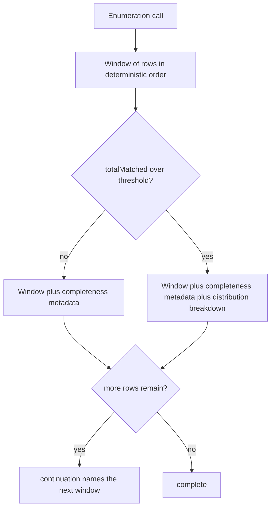

# Result Ordering and Pagination - Plan

## Goal Capsule

- **Objective.** Make the enumeration tools honest about the order they return and complete about the set they cover: a declared-artificial but deterministic order, real windowed paging over it, and a narrowing aid when a result set is too large to page through.
- **Product authority.** This plan owns the ordering and truncation contract of the three enumeration tools — `ea_search`, `ea_list_elements`, `ea_list_diagrams` — plus relevance ranking within `ea_search`. The diacritic-insensitive *matching* layer is settled and out of scope; only *ordering* changes.
- **Open blockers.** None. All three questions raised during the brainstorm were resolved before handoff.

---

## Product Contract

### Summary

Enumeration tools gain offset-windowed paging over an order that is deterministic and documented as artificial. When a result set is too large to walk, the response also reports how the matches distribute along a narrowing axis, so an agent can ask a better question instead of listing pages. Search stops letting an unordered scan decide which matches reach the first page.

### Problem Frame

Three defects share one root: no tool owns its order, and truncation therefore selects arbitrarily.

`ea_list_elements` orders by name under SQLite's binary collation, which sorts every accented initial after `Z`. Measured against the working export, that is not a cosmetic misordering but a systematic exclusion. Across the packages that actually truncate at the current limit, names with an accented initial fill 1.3% of visible slots under binary ordering and 3.0% under storage order — and storage order is the unbiased reference, because it is a sample of those packages rather than a selection from their alphabetical head. Locale-aware collation lands at 2.0%: better than binary, still an alphabetical cut. The current order is the worst of the three available, and the tool description promises nothing that would warn a reader.

`ea_list_diagrams` has no ordering clause at all. Called without a package filter it returns 50 of roughly ten thousand diagrams — half a percent — chosen by whatever scan order SQLite happens to use. Order is not merely undocumented there; it is not guaranteed to be repeatable, since the same query can return rows in a different sequence once a different query plan is chosen.

`ea_search` ranks matches into five relevance tiers and truncates. On the working export the cut fell inside the same tier for every probe query tried, and that tier is large: a common word matches ~12,000 elements with ~3,800 of them tied in one tier. Which 25 the agent sees is decided by the order rows came out of an unordered corpus scan. The existing remedy — a `continuation` that re-runs the query with a doubled limit — transfers roughly twice the rows it eventually shows and never makes the first page better.

Documentation has drifted alongside. `README.md` already describes `ea_list_elements` as reporting its total "with pagination", which no parameter provides, and `docs/solutions/architecture-patterns/ea-model-reading-coverage.md` records an ordering decision that the code has since superseded.

### Key Decisions

- KD1. **Declared-artificial ordering, not collation.** (session-settled: user-directed — chosen over locale-aware alphabetical ordering: measured that any alphabetical cut under-represents accented initials while storage order does not.) Governs R1, R2, R3.
- KD2. **Full traversal is a supported use, not an anti-goal.** (session-settled: user-directed — chosen over steering agents to filter instead.) Governs R4, R5, R6.
- KD3. **Offset windows, not keyset cursors.** (session-settled: user-directed — chosen over cursor tokens: one mechanism serves both SQL-side and JS-side collections, and the deepest set in the working export is ~1,350 rows.) Governs R4, R5.
- KD4. **Above a threshold, describe the haystack instead of sampling it.** (session-settled: user-directed — chosen over paging alone: walking ~10,000 diagrams or ~12,000 matches is available but never the useful move.) Governs R9, R12.
- KD5. **Finer relevance ranking ships with paging, not after it.** (session-settled: user-approved — chosen over paging the existing five tiers: paging a tie lists noise in a fixed order.) Governs R8.
- KD6. **Identity breaks every tie.** Paging is only coherent over a total order, so tie-breaking is a correctness requirement rather than presentation polish. Governs R1, R7.
- KD7. **The breakdown trips on a multiple of the requested window, not an absolute count.** (session-settled: user-approved — chosen over a fixed count and over always-on-truncation: the trigger should track how many pages remain, which is the reason the breakdown exists.) Governs R9.
- KD8. **Every breakdown key is a valid next argument.** (session-settled: user-directed — chosen over grouping along whichever axis reads best: an axis with no matching filter hands the agent a diagnosis without a remedy, so `ea_list_diagrams` gains the filter its useful axis needs.) Governs R10, R11.
- KD9. **Default limits stay where they are.** (session-settled: user-approved — chosen over raising them to 100: the packages that actually hurt truncate at any sane limit and are served by paging, so a raise buys only the 51–100 band while doubling the ceiling on every large response.) Governs the corresponding Scope Boundary.

### Requirements

**Ordering contract**

- R1. Each of the three enumeration tools returns rows in a deterministic total order. Two identical calls against the same export return the same rows in the same positions.
- R2. That order is the model's storage identity ascending, never the element or diagram name. `ea_list_elements` keeps grouping by element type ahead of identity, because the grouping reads well and stays deterministic.
- R3. Each affected tool description states that the order is stable but artificial — neither alphabetical nor the analyst's tree order — so no agent infers meaning from adjacency.

**Paging**

- R4. `ea_search`, `ea_list_elements`, and `ea_list_diagrams` accept a window offset alongside the existing limit.
- R5. When a response is truncated, `continuation` names the next window rather than a larger limit. Following `continuation` repeatedly visits every matching row exactly once and terminates.
- R6. Every paged response reports enough for a caller to know its position in the set without tracking state across calls.

**Search relevance**

- R7. Matches tied within a relevance tier are ordered by element identity, so no page repeats or skips a row.
- R8. Relevance ranking separates matches more finely than the current five tiers, so the first page of a common-word query holds the strongest matches rather than an arbitrary slice of a large tie.

**Narrowing a hopeless set**

- R9. When `totalMatched` exceeds a fixed multiple of the requested limit, the response additionally reports how the matches distribute along a narrowing axis.
- R10. Every key in that distribution is a value the caller can pass straight back to the same tool as a filter argument. `ea_search` reports along element type and stereotype, `ea_list_elements` along element type, `ea_list_diagrams` along diagram type.
- R11. `ea_list_diagrams` accepts a diagram-type filter, so its breakdown axis is one a caller can act on.
- R12. The breakdown is additive. It never replaces the result window, and its absence below the threshold is not an error.

**Documentation truth**

- R13. `README.md` describes the ordering and paging that exist, and drops the pagination claim it makes today for a tool that has no paging parameter.
- R14. The superseded ordering decision in `docs/solutions/architecture-patterns/ea-model-reading-coverage.md` is corrected to match shipped behavior.

### Response shape above and below the threshold

### Acceptance Examples

- AE1. Complete traversal.
  - **Covers R4, R5, R7.**
  - **Given** a query whose match count exceeds the window size.
  - **When** the caller follows `continuation` until it stops being offered.
  - **Then** the union of all windows equals the full match set, with no row seen twice and none missing.
- AE2. Repeatability.
  - **Covers R1.**
  - **Given** the same export and the same arguments.
  - **When** the call is issued twice, including once with an optional type filter applied.
  - **Then** both responses hold the same rows in the same positions.
- AE3. Ordering is not biased against diacritics.
  - **Covers R2.**
  - **Given** a package large enough to truncate, containing names with accented initials.
  - **When** the first window is returned.
  - **Then** accented initials appear in roughly their share of the package, rather than the reduced share an alphabetical cut produces.
- AE4. Broad result sets describe themselves in actionable terms.
  - **Covers R9, R10, R11, R12.**
  - **Given** an unfiltered diagram listing, whose match count far exceeds one window.
  - **When** the response is returned.
  - **Then** it carries the ordinary window unchanged plus a distribution whose every key can be passed back as a filter argument to narrow the next call.
- AE5. The first page is worth reading.
  - **Covers R8.**
  - **Given** a common word that matches element names, notes, and attribute text alike.
  - **When** the first window is returned.
  - **Then** it is dominated by the strongest match class rather than by whichever tied rows the corpus scan happened to reach first.

### Scope Boundaries

- Keyset or opaque cursor tokens. Rejected in favour of offsets; see KD3.
- Locale-aware name collation in enumeration. `EA_LOCALE` and the shared name comparator continue to serve scenario ordering only, where the largest set in the working export is 19 items and truncation never occurs.
- Diacritic- and entity-insensitive matching. That layer governs *which* rows match, not their order, and is unaffected.
- `ea_get_connectors`, `ea_get_scenarios`, `ea_get_diagram_elements`, and the inline attribute and operation caps in `ea_get_element`. These return whole sets or use caps already justified by measurement; the busiest element carries ~615 connectors and that stays a single response.
- Replacing the search implementation. Ranking gets finer, the matching mechanism does not change.
- Raising the default limits. They stay at 25 for `ea_search` and 50 for the other two; see KD9.

### Outstanding Questions

**Resolve Before Planning**

None. The threshold rule, the breakdown axis, and the default-limit question were all settled during the brainstorm and now live in Key Decisions.

**Deferred to Planning**

- Which multiple of the limit trips the breakdown. The 10x discussed is a starting point, not a settled constant.
- The field names and exact shape of the window and breakdown data, and whether the description-contract test's shared contract-field set grows to cover them.
- Which additional relevance signals refine the ranking, and how tiers are numbered afterwards.
- Whether the corpus that backs search needs a defined build order, or whether tie-breaking by identity makes that unnecessary.

### Sources / Research

Measurements were taken against the working export with a read-only script. Table sizes are reported to the same order-of-magnitude convention the existing coverage document uses; ratios are exact.

Ordering bias, measured across the 136 packages that truncate at the current limit of 50, over 6,800 visible slots:

| Order applied | Slots holding an accented initial |
|---|---|
| Binary `ORDER BY` on name (today) | 1.3% |
| Locale-aware collation | 2.0% |
| Storage identity (unbiased reference) | 3.0% |

Model-wide, 3.9% of element names carry an accented initial. Binary and collated ordering differ on 3.1% of visible slots.

How often the current limit truncates `ea_list_elements`, by candidate limit:

| Limit | Packages that truncate | Share of all elements they hold |
|---|---|---|
| 25 | 6.9% | 41.9% |
| 50 (today) | 1.9% | 22.5% |
| 100 | 0.5% | 11.6% |
| 200 | 0.1% | 5.8% |

Package size: median 4, p90 19, p99 72, largest ~1,350. Raising the default from 50 to 100 would therefore stop truncation only for the 1.4% of packages holding 51–100 elements; the packages that genuinely hurt truncate at any sane limit and are served by paging instead. The repository previously rejected a paging parameter for inline child data at the 0.1% rarity mark — recorded so the trade-off stays visible if the limit question is ever reopened.

Other figures behind the framing: ~10,000 diagrams, of which an unfiltered `ea_list_diagrams` call shows 0.5%, though only 2 of ~6,300 packages hold more than 50 diagrams; a search corpus of ~230,000 entries built once per open model and cached; a common query matching ~12,000 elements with ~3,800 tied in a single relevance tier; ~70,000 elements and ~80,000 connectors overall.

Code the planner will need to touch: `src/tools/search.ts`, `src/tools/elements.ts`, `src/tools/diagrams.ts`, the response-contract prose in `src/index.ts`, and the contract tests in `test/response-contract.test.ts` and `test/description-contract.test.ts`.
