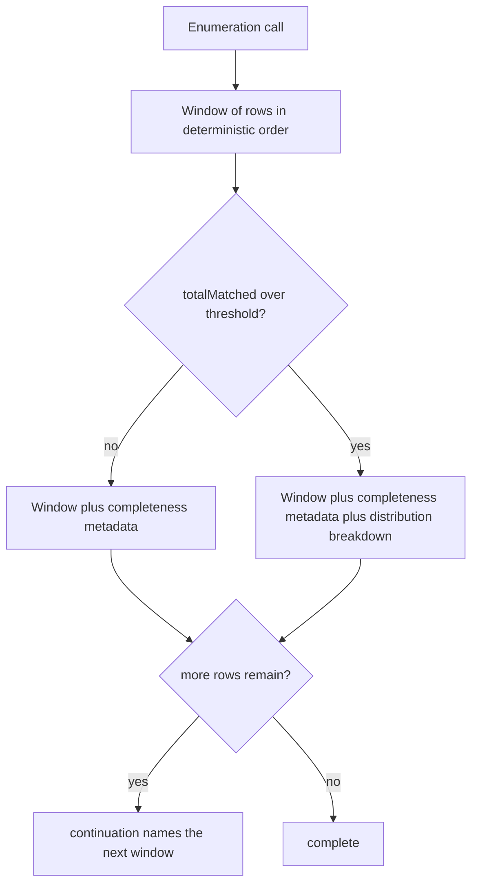
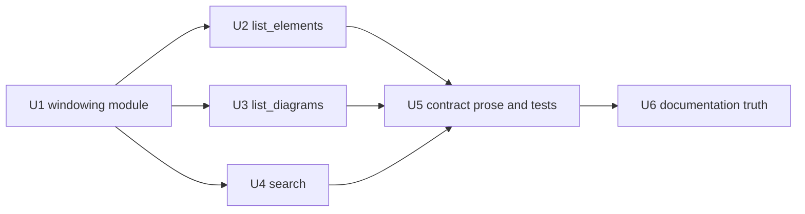

# Result Ordering and Pagination - Plan

## Goal Capsule

- **Objective.** Make the enumeration tools honest about the order they return and complete about the set they cover: a declared-artificial but deterministic order, real windowed paging over it, and a narrowing aid when a result set is too large to page through.
- **Product authority.** This plan owns the ordering and truncation contract of the three enumeration tools — `ea_search`, `ea_list_elements`, `ea_list_diagrams` — plus relevance ranking within `ea_search`. The diacritic-insensitive *matching* layer is settled and out of scope; only *ordering* changes.
- **Open blockers.** None. All three questions raised during the brainstorm were resolved before handoff, and the four questions deferred to planning are answered in Key Technical Decisions.
- **Execution profile.** Contract-test-first. Both contract suites already assert the response and description shape for every tool, so each unit extends them before changing the tool it covers; a shape change that lands without its assertion is indistinguishable from drift. The repository ships `dist/` in git, so `npm run build` precedes every commit.
- **Stop conditions.** Stop and report if a measurement in Sources turns out not to reproduce against the working export, or if the deterministic-order requirement (R1) cannot be met for a collection this plan claims to cover.

---

## Product Contract

### Summary

Enumeration tools gain offset-windowed paging over an order that is deterministic and documented as artificial. When a result set is too large to walk, the response also reports how the matches distribute along a narrowing axis, so an agent can ask a better question instead of listing pages. Search stops letting an unordered scan decide which matches reach the first page.

### Problem Frame

Three defects share one root: no tool owns its order, and truncation therefore selects arbitrarily.

`ea_list_elements` orders by name under SQLite's binary collation, which sorts every accented initial after `Z`. Measured against the working export, that is not a cosmetic misordering but a systematic exclusion. Across the packages that actually truncate at the current limit, names with an accented initial fill 1.3% of visible slots under binary ordering and 3.0% under storage order — and storage order is the unbiased reference, because it is a sample of those packages rather than a selection from their alphabetical head. Locale-aware collation lands at 2.0%: better than binary, still an alphabetical cut. The current order is the worst of the three available, and the tool description promises nothing that would warn a reader.

`ea_list_diagrams` has no ordering clause at all. Called without a package filter it returns 50 of roughly ten thousand diagrams — half a percent — chosen by whatever scan order SQLite happens to use. Order is not merely undocumented there; it is not guaranteed to be repeatable, since the same query can return rows in a different sequence once a different query plan is chosen.

`ea_search` ranks matches into five relevance tiers and truncates. On the working export the cut fell inside the same tier for every probe query tried, and that tier is large: a common word matches ~12,000 elements with ~3,800 of them tied in one tier. Which 25 the agent sees is decided by the order rows came out of an unordered corpus scan. The existing remedy — a `continuation` that re-runs the query with a doubled limit — transfers roughly twice the rows it eventually shows and never makes the first page better.

Documentation has drifted alongside. `README.md` already describes `ea_list_elements` as reporting its total "with pagination", which no parameter provides, and `docs/solutions/architecture-patterns/ea-model-reading-coverage.md` records an ordering decision that the code has since superseded.

### Key Decisions

- KD1. **Declared-artificial ordering, not collation.** (session-settled: user-directed — chosen over locale-aware alphabetical ordering: measured that any alphabetical cut under-represents accented initials while storage order does not.) Governs R1, R2, R3.
- KD2. **Full traversal is a supported use, not an anti-goal.** (session-settled: user-directed — chosen over steering agents to filter instead.) Governs R4, R5, R6.
- KD3. **Offset windows, not keyset cursors.** (session-settled: user-directed — chosen over cursor tokens: one mechanism serves both SQL-side and JS-side collections, and the deepest set in the working export is ~1,350 rows.) Governs R4, R5.
- KD4. **Above a threshold, describe the haystack instead of sampling it.** (session-settled: user-directed — chosen over paging alone: walking ~10,000 diagrams or ~12,000 matches is available but never the useful move.) Governs R9, R12.
- KD5. **Finer relevance ranking ships with paging, not after it.** (session-settled: user-approved — chosen over paging the existing five tiers: paging a tie lists noise in a fixed order.) Governs R8.
- KD6. **Identity breaks every tie.** Paging is only coherent over a total order, so tie-breaking is a correctness requirement rather than presentation polish. Governs R1, R7.
- KD7. **The breakdown trips on a multiple of the requested window, not an absolute count.** (session-settled: user-approved — chosen over a fixed count and over always-on-truncation: the trigger should track how many pages remain, which is the reason the breakdown exists.) Governs R9.
- KD8. **Every breakdown key is a valid next argument.** (session-settled: user-directed — chosen over grouping along whichever axis reads best: an axis with no matching filter hands the agent a diagnosis without a remedy, so `ea_list_diagrams` gains the filter its useful axis needs.) Governs R10, R11.
- KD9. **Default limits stay where they are.** (session-settled: user-approved — chosen over raising them to 100: the packages that actually hurt truncate at any sane limit and are served by paging, so a raise buys only the 51–100 band while doubling the ceiling on every large response.) Governs the corresponding Scope Boundary.

### Requirements

**Ordering contract**

- R1. Each of the three enumeration tools returns rows in a deterministic total order. Two identical calls against the same export return the same rows in the same positions.
- R2. That order is the model's storage identity ascending, never the element or diagram name. `ea_list_elements` keeps grouping by element type ahead of identity, because the grouping reads well and stays deterministic.
- R3. Each affected tool description states that the order is stable but artificial — neither alphabetical nor the analyst's tree order — so no agent infers meaning from adjacency.

**Paging**

- R4. `ea_search`, `ea_list_elements`, and `ea_list_diagrams` accept a window offset alongside the existing limit.
- R5. When a response is truncated, `continuation` names the next window rather than a larger limit. Following `continuation` repeatedly visits every matching row exactly once and terminates.
- R6. Every paged response reports enough for a caller to know its position in the set without tracking state across calls.

**Search relevance**

- R7. Matches tied within a relevance tier are ordered by element identity, so no page repeats or skips a row.
- R8. Relevance ranking separates matches more finely than the current five tiers, so the first page of a common-word query holds the strongest matches rather than an arbitrary slice of a large tie.

**Narrowing a hopeless set**

- R9. When `totalMatched` exceeds a fixed multiple of the requested limit, the response additionally reports how the matches distribute along a narrowing axis.
- R10. Every key in that distribution is a value the caller can pass straight back to the same tool as a filter argument. `ea_search` reports along element type and stereotype, `ea_list_elements` along element type, `ea_list_diagrams` along diagram type.
- R11. `ea_list_diagrams` accepts a diagram-type filter, so its breakdown axis is one a caller can act on.
- R12. The breakdown is additive. It never replaces the result window, and its absence below the threshold is not an error.

**Documentation truth**

- R13. `README.md` describes the ordering and paging that exist, and drops the pagination claim it makes today for a tool that has no paging parameter.
- R14. The superseded ordering decision in `docs/solutions/architecture-patterns/ea-model-reading-coverage.md` is corrected to match shipped behavior.

### Response shape above and below the threshold



### Acceptance Examples

- AE1. Complete traversal.
  - **Covers R4, R5, R7.**
  - **Given** a query whose match count exceeds the window size.
  - **When** the caller follows `continuation` until it stops being offered.
  - **Then** the union of all windows equals the full match set, with no row seen twice and none missing.
- AE2. Repeatability.
  - **Covers R1.**
  - **Given** the same export and the same arguments.
  - **When** the call is issued twice, including once with an optional type filter applied.
  - **Then** both responses hold the same rows in the same positions.
- AE3. Ordering is not biased against diacritics.
  - **Covers R2.**
  - **Given** a package large enough to truncate, containing names with accented initials.
  - **When** the first window is returned.
  - **Then** accented initials appear in roughly their share of the package, rather than the reduced share an alphabetical cut produces.
- AE4. Broad result sets describe themselves in actionable terms.
  - **Covers R9, R10, R11, R12.**
  - **Given** an unfiltered diagram listing, whose match count far exceeds one window.
  - **When** the response is returned.
  - **Then** it carries the ordinary window unchanged plus a distribution whose every key can be passed back as a filter argument to narrow the next call.
- AE5. The first page is worth reading.
  - **Covers R8.**
  - **Given** a common word that matches element names, notes, and attribute text alike.
  - **When** the first window is returned.
  - **Then** it is dominated by the strongest match class rather than by whichever tied rows the corpus scan happened to reach first.

### Scope Boundaries

- Keyset or opaque cursor tokens. Rejected in favour of offsets; see KD3.
- Locale-aware name collation in enumeration. `EA_LOCALE` and the shared name comparator continue to serve scenario ordering only, where the largest set in the working export is 19 items and truncation never occurs.
- Diacritic- and entity-insensitive matching. That layer governs *which* rows match, not their order, and is unaffected.
- `ea_get_connectors`, `ea_get_scenarios`, `ea_get_diagram_elements`, and the inline attribute and operation caps in `ea_get_element`. These return whole sets or use caps already justified by measurement; the busiest element carries ~615 connectors and that stays a single response.
- Replacing the search implementation. Ranking gets finer, the matching mechanism does not change.
- Raising the default limits. They stay at 25 for `ea_search` and 50 for the other two; see KD9.

### Outstanding Questions

**Resolve Before Planning**

None. The threshold rule, the breakdown axis, and the default-limit question were all settled during the brainstorm and now live in Key Decisions.

**Deferred to Planning — now resolved**

All four are answered in the Planning Contract and none blocks execution.

- Which multiple of the limit trips the breakdown → KTD5.
- Field names and shape of the window and breakdown data, and whether the shared contract-field set grows → KTD3, KTD6.
- Which additional relevance signals refine the ranking, and how tiers are numbered → KTD7.
- Whether the search corpus needs a defined build order → KTD8. It does not, and the reason is structural rather than incidental.

### Sources / Research

Measurements were taken against the working export with a read-only script. Table sizes are reported to the same order-of-magnitude convention the existing coverage document uses; ratios are exact.

Ordering bias, measured across the 136 packages that truncate at the current limit of 50, over 6,800 visible slots:

| Order applied | Slots holding an accented initial |
|---|---|
| Binary `ORDER BY` on name (today) | 1.3% |
| Locale-aware collation | 2.0% |
| Storage identity (unbiased reference) | 3.0% |

Model-wide, 3.9% of element names carry an accented initial. Binary and collated ordering differ on 3.1% of visible slots.

How often the current limit truncates `ea_list_elements`, by candidate limit:

| Limit | Packages that truncate | Share of all elements they hold |
|---|---|---|
| 25 | 6.9% | 41.9% |
| 50 (today) | 1.9% | 22.5% |
| 100 | 0.5% | 11.6% |
| 200 | 0.1% | 5.8% |

Package size: median 4, p90 19, p99 72, largest ~1,350. Raising the default from 50 to 100 would therefore stop truncation only for the 1.4% of packages holding 51–100 elements; the packages that genuinely hurt truncate at any sane limit and are served by paging instead. The repository previously rejected a paging parameter for inline child data at the 0.1% rarity mark — recorded so the trade-off stays visible if the limit question is ever reopened.

Other figures behind the framing: ~10,000 diagrams, of which an unfiltered `ea_list_diagrams` call shows 0.5%, though only 2 of ~6,300 packages hold more than 50 diagrams; a search corpus of ~230,000 entries built once per open model and cached; a common query matching ~12,000 elements with ~3,800 tied in a single relevance tier; ~70,000 elements and ~80,000 connectors overall.

Code the planner will need to touch: `src/tools/search.ts`, `src/tools/elements.ts`, `src/tools/diagrams.ts`, the response-contract prose in `src/index.ts`, and the contract tests in `test/response-contract.test.ts` and `test/description-contract.test.ts`.

---

## Planning Contract

### Key Technical Decisions

- **KTD1. `truncated` changes meaning from "the set is bigger than one window" to "rows remain after this window."** It becomes `offset + returned < totalMatched`. Without this, a caller landing on the final page of a large set would still see `truncated: true` and a `continuation` pointing past the end, and R5's termination guarantee would not hold. The field name and its always-present status are unchanged, so the server-instruction contract in `src/index.ts` still describes it accurately once the prose gains the window sentence.

- **KTD2. Ordering is pushed to whichever layer already owns the row set, not unified.** `ea_list_elements` orders and windows in SQL (`ORDER BY Object_Type, Object_ID LIMIT ? OFFSET ?`) because its filters are all SQL-side. `ea_list_diagrams` orders in SQL (`ORDER BY Diagram_ID`) but windows in JS, because `nameContains` folds text and cannot be expressed in SQLite. `ea_search` orders and windows in JS over the corpus match set. Forcing one mechanism on all three would mean either dropping SQL windowing for elements or reimplementing folded matching in SQL; neither buys anything a caller can observe.

- **KTD3. The window parameter is `offset`, a non-negative integer defaulting to `0`, and it is echoed back at the top level of the response.** `offset` plus the existing `returned` and `totalMatched` satisfies R6 with no new bookkeeping: position is `offset`, remaining is `totalMatched - offset - returned`. `continuation.arguments.offset` becomes `offset + returned`, which is why following it repeatedly visits every row exactly once and terminates (R5).

- **KTD4. `continuation` stops doubling the limit.** Today it re-runs the same query with `limit: Math.max(limit * 2, totalMatched)`, which is the mechanism the Problem Frame criticizes. It keeps the caller's `limit` and advances `offset` instead. This is a behavior change to an existing documented field, so it is covered by an explicit test rather than left to the contract suites.

- **KTD5. The breakdown trips at `totalMatched > 10 * limit`, a single shared constant.** Ten windows is the point where paging stops being a plausible plan. Checked against the working export at default limits, the trigger fires where the Problem Frame says it should and stays quiet elsewhere: unfiltered diagrams (9,717 > 500) fire, the largest package (~1,350 > 500) fires, a common-word search (~12,600 > 250) fires, while the median package (4 elements) and a specific search such as `zmluva` (117 < 250) do not. Because the threshold scales with the caller's own `limit`, a caller who asks for a bigger window is judged against that window rather than an absolute number they never chose (KD7).

- **KTD6. `breakdown` is an object keyed by parameter name, and each axis carries its own collection metadata.** Keying by parameter name — not by database column — is what makes R10 mechanical rather than aspirational: every key is literally the argument name to pass back, and every `value` is literally the argument value.

  ```json
  "breakdown": {
    "objectType": {
      "values": [{ "value": "Class", "count": 812 }],
      "totalMatched": 37, "returned": 20, "truncated": true
    }
  }
  ```

  Per-axis metadata follows the precedent `ea_get_diagram_elements` already sets for a response holding more than one independent collection, so the response contract needs no exception for it. Values are ordered by `count` descending, then `value` ascending, and capped at 20 per axis. An axis is omitted entirely when its corresponding filter argument is already set (the breakdown would be one row restating the filter) or when it holds fewer than two distinct values. Counts are computed over the whole match set, never the window.

- **KTD7. Relevance becomes an injective ladder over (table, field), refined for name matches, with `Object_ID` as the final tiebreak.** The current five ranks collapse three tables into rank 4 and lump every non-exact name match into rank 1. The replacement ladder:

  | Rank | Source | Match shape |
  |---|---|---|
  | 0 | `t_object.Name` | equals the query |
  | 1 | `t_object.Name` | starts with the query |
  | 2 | `t_object.Name` | query begins at a word boundary |
  | 3 | `t_object.Name` | query appears elsewhere |
  | 4 | `t_object.Alias` | any |
  | 5 | `t_object.Note` | any |
  | 6 | `t_attribute.Name` | any |
  | 7 | `t_operation.Name` | any |
  | 8 | `t_attribute.Notes` | any |
  | 9 | `t_operation.Notes` | any |
  | 10 | `t_objectconstraint.Notes` | any |

  Within a rank, name and alias matches order by query coverage (`foldedQuery.length / foldedText.length`) descending, so `Stav` outranks `Zoznam stavov zmluvy` for the query `stav`; coverage is not applied to note and feature matches, where the ratio measures document length rather than relevance. `Object_ID` ascending breaks whatever remains. The ladder is internal — `rank` is not a response field and only `matchedIn` is exposed — so renumbering changes ordering without changing the response shape.

- **KTD8. The search corpus keeps no defined build order, because the ladder makes order unobservable.** This was an open question and the answer is structural, not a judgement call. Ranks 0–3 all resolve to the same `matchedIn` string (`t_object.Name`), and every rank from 4 up maps to exactly one (table, field) pair. So for a given object, the best rank determines `matchedIn` uniquely no matter which corpus entry is visited first. Combined with the `Object_ID` final tiebreak, two runs over corpora built in different scan orders produce identical responses. Had the ladder kept one rank spanning three tables, `matchedIn` would have been decided by scan order and the corpus *would* have needed one — so this is a property to preserve deliberately, not a coincidence to rely on.

- **KTD9. Windowing logic lives in one module, `src/tools/windowing.ts`.** Three tools need the same threshold constant, the same `offset` parameter schema, the same `continuation` construction, and the same breakdown assembly. Three copies of a termination rule is three chances to get R5 wrong. The module holds no tool-specific knowledge: axis extraction stays in each tool, since only the tool knows which of its parameters an axis corresponds to.

### Assumptions

- The fixture in `test/helpers/test-db.ts` is small. Paging, threshold, and breakdown behavior need a package with enough rows to produce several windows at a low explicit `limit`; the tests pass `limit` explicitly rather than growing the fixture to hundreds of rows.
- `offset` is not accepted by `ea_get_connectors`, `ea_get_scenarios`, `ea_get_diagram_elements`, or `ea_get_element`. Those stay whole-set responses per the Scope Boundaries.
- No caller depends on the current `continuation` doubling behavior; the server is read-only and `continuation` is advisory.

### Sequencing



---

## Implementation Units

### U1. Shared windowing module

- **Goal.** One place owns the window arithmetic, the breakdown threshold, and the termination rule.
- **Requirements.** R4, R5, R6, R9, R12.
- **Files.** `src/tools/windowing.ts` (new), `test/windowing.test.ts` (new).
- **Approach.** Export the `offset` Zod schema (coerced, integer, `min(0)`, default `0`, described for agents), the `BREAKDOWN_LIMIT_FACTOR = 10` constant, a predicate deciding whether a breakdown applies, a `continuation` builder that returns `undefined` when no rows remain, and a breakdown assembler that turns counted values into the KTD6 shape. Per KTD9 it takes counts, not rows — axis extraction belongs to the caller.
- **Test scenarios.**
  - `truncated` is false and no continuation is produced when `offset + returned === totalMatched`, including when `offset` is 0 and the window covers everything.
  - A continuation advances `offset` by `returned` and preserves the caller's `limit` and filter arguments.
  - Walking from `offset: 0` by repeatedly applying the builder terminates and covers every index exactly once, for a set size that is both a multiple and a non-multiple of the window.
  - An `offset` beyond `totalMatched` yields an empty window, `truncated: false`, and no continuation rather than an error.
  - The breakdown predicate fires strictly above `10 * limit` and not at exactly `10 * limit`.
  - Breakdown values sort by count descending then value ascending, cap at 20, and report `totalMatched`/`returned`/`truncated` for the axis.
- **Verification.** `npx jest test/windowing.test.ts`.

### U2. `ea_list_elements` — deterministic order, offset, breakdown

- **Goal.** Replace the name-ordered window with an identity-ordered one that can be paged and, when hopeless, described.
- **Requirements.** R1, R2, R3, R4, R5, R6, R9, R10, R12.
- **Files.** `src/tools/elements.ts`, `test/tools.test.ts`.
- **Approach.** Change the clause to `ORDER BY Object_Type, Object_ID LIMIT ? OFFSET ?`, keeping the type grouping R2 preserves. Add `offset` from U1. Derive `truncated` per KTD1 from the existing count query. When the breakdown applies and `objectType` was not supplied, add a `GROUP BY Object_Type` count over the same filter as the count query. Update the description to name `offset` and `breakdown` and to state that order is stable but artificial (R3).
- **Test scenarios.**
  - Two identical calls return the same rows in the same positions (R1).
  - A package holding names with accented initials returns them in identity order, and a name that binary collation would exile past `Z` appears in the first window (R2, AE3).
  - `limit: 2` walked by `continuation` yields the whole package with no repeats and no gaps, and the final response has `truncated: false` and no `continuation` (AE1).
  - An `objectType` filter combined with `offset` stays consistent across two identical calls (AE2).
  - Below the threshold no `breakdown` key is present, and its absence is not an error (R12).
  - Above the threshold — forced with a small `limit` — `breakdown.objectType` appears, its counts sum to `totalMatched`, and each key is accepted as the `objectType` argument on a follow-up call (R10).
  - With `objectType` already supplied, the `objectType` axis is omitted.
- **Verification.** `npm test`.

### U3. `ea_list_diagrams` — order, offset, `diagramType` filter, breakdown

- **Goal.** Give the tool a repeatable order and the filter its breakdown axis needs.
- **Requirements.** R1, R2, R3, R4, R5, R6, R9, R10, R11, R12.
- **Files.** `src/tools/diagrams.ts`, `test/tools.test.ts`.
- **Approach.** Add `ORDER BY Diagram_ID` to the select. Add a `diagramType` parameter filtering `Diagram_Type` in SQL alongside `Package_ID`. Keep `nameContains` folding in JS, then apply `offset`/`limit` to the filtered array (KTD2). Breakdown axis is `diagramType`, counted over the filtered set, omitted when `diagramType` is supplied. Update the description for `diagramType`, `offset`, `breakdown`, and the R3 ordering sentence.
- **Test scenarios.**
  - The unfiltered listing returns identical rows in identical positions across two calls (R1, AE2) — the defect here is the absent `ORDER BY`, so this is the regression guard.
  - `diagramType` narrows the set, and combining it with `nameContains` applies both.
  - A `diagramType` value taken from a breakdown returns a non-empty, narrower result (R11, AE4).
  - Paging by `continuation` with `nameContains` active covers the filtered set exactly once — this is the JS-side window, so it is tested separately from U2's SQL-side one.
  - Above the threshold the response carries the ordinary window unchanged *plus* `breakdown.diagramType` (R12, AE4).
  - A non-existent `packageId` still returns the structured not-found error, unchanged.
- **Verification.** `npm test`.

### U4. `ea_search` — relevance ladder, tiebreak, offset, breakdown

- **Goal.** Stop letting corpus scan order pick the first page, and make that page the strongest matches rather than an arbitrary slice of a tie.
- **Requirements.** R1, R3, R4, R5, R6, R7, R8, R9, R10, R12.
- **Files.** `src/tools/search.ts`, `test/tools.test.ts`.
- **Approach.** Replace the rank assignment with the KTD7 ladder, retaining coverage alongside rank in the match map. Sort by rank ascending, coverage descending, `Object_ID` ascending. Apply `offset`/`limit` after filters. Breakdown axes are `objectType` and `stereotype`, counted from the already-fetched matched rows, each omitted when its filter is supplied. Update the description for `offset` and `breakdown` and the R3 ordering sentence.
- **Test scenarios.**
  - An exact name match outranks a prefix match, which outranks a word-boundary match, which outranks an interior substring (R8).
  - For equal rank, the shorter name — higher coverage — comes first.
  - A name match outranks a note match, which outranks an attribute-notes match.
  - Two objects tied at the same rank and coverage order by `Object_ID` ascending, and the order holds across repeated calls (R7, R1).
  - `matchedIn` is stable for an object matching in more than one feature table — the KTD8 property, and the one that would silently regress if a future edit collapsed ranks 6–10.
  - Paging by `continuation` over a multi-page result covers every match exactly once and terminates (AE1).
  - A query matching far more than `10 * limit` returns `breakdown.objectType`, whose counts sum to `totalMatched` (AE5, R10).
  - The empty-query and no-match branches keep returning `truncated: false` with no `breakdown` and no `continuation`.
- **Verification.** `npm test`.

### U5. Response contract prose and contract tests

- **Goal.** The two contract suites and the server instructions describe the shape the tools now return.
- **Requirements.** R3, R6, R12.
- **Files.** `src/index.ts`, `test/description-contract.test.ts`, `test/response-contract.test.ts`.
- **Approach.** In the server instructions, restate the `continuation` bullet as advancing a window rather than retrieving the full set, and add one bullet for `offset` and one for the conditional `breakdown`. Add `offset` and `breakdown` to `CONTRACT_FIELDS`, matching that set's existing rationale — both are documented once centrally, so no individual description must restate them. Leave `continuation` out of that set: it is named per description today and this plan is not the place to relax it.
- **Test scenarios.**
  - Both existing contract suites pass unchanged for every tool, including the ones this plan does not touch.
  - A response-contract case asserts a paged tool echoes `offset` and that `truncated` agrees with `offset + returned < totalMatched`.
  - A response-contract case asserts a tool without paging never returns `offset`, `breakdown`, or a windowed `continuation` — the boundary this plan drew is worth a test, since the natural next edit is to spread paging everywhere.
- **Verification.** `npm test`.

### U6. Documentation truth

- **Goal.** The prose stops describing behavior the code does not have.
- **Requirements.** R13, R14.
- **Files.** `README.md`, `docs/solutions/architecture-patterns/ea-model-reading-coverage.md`.
- **Approach.** Replace the `ea_list_elements` line that claims pagination it did not have with an accurate description of `offset` paging, and document the ordering guarantee and the breakdown alongside it. In the coverage document, record that enumeration ordering moved to storage identity and that `Intl.Collator`/`EA_LOCALE` now serves scenario ordering only — the earlier record described enumeration collation that this plan removes.
- **Test scenarios.** None; documentation carries no assertions. Correctness is checked by reading each claim against the shipped parameter list.
- **Verification.** `npm run build && npm test`.

---

## Verification Contract

- `npm run build` — TypeScript compilation. Required before every commit because `dist/` is tracked in git; a commit whose `dist/` lags `src/` ships stale behavior to anyone installing from the repo.
- `npm test` — the full Jest suite, 10 suites and 248 tests at plan time. The two contract suites are the primary gate: `test/response-contract.test.ts` proves the shape and `test/description-contract.test.ts` proves the descriptions match it in both directions.
- `npx jest test/windowing.test.ts` — fast inner loop while U1 is in progress.
- Every unit that changes a tool description must leave `test/description-contract.test.ts` green without weakening it. Adding a field to `CONTRACT_FIELDS` to silence a failure is legitimate only for a field documented centrally in `src/index.ts`; doing it to avoid writing a description sentence defeats the suite.
- No new dependency. The work is arithmetic and SQL clauses.

## Definition of Done

**Global**

- All three enumeration tools accept `offset`, return it, and produce a `continuation` that advances rather than enlarges.
- Following `continuation` from `offset: 0` on any of the three tools visits every matching row exactly once and terminates.
- No enumeration tool orders by `Name`.
- `npm run build` and `npm test` both pass, with the suite count no lower than at plan time.
- `README.md` contains no claim about ordering or paging that the shipped parameter list contradicts.
- Per the repository's release process, adding optional parameters and changing tool descriptions is a minor version bump — the bump belongs to publishing, not to these commits.

**Per unit**

- U1 — the module exists, is imported by all three tools, and its termination test walks a full set.
- U2 — the SQL clause is `ORDER BY Object_Type, Object_ID LIMIT ? OFFSET ?` and a package with accented initials shows them in the first window.
- U3 — `ea_list_diagrams` has an `ORDER BY`, accepts `diagramType`, and its breakdown keys work as arguments.
- U4 — the ladder is injective on (table, field) above rank 3, and `matchedIn` is asserted stable for a multi-table match.
- U5 — both contract suites pass, and a test pins that non-enumeration tools stayed out of paging.
- U6 — the pagination claim in `README.md` is true, and the coverage document's ordering record matches shipped behavior.
