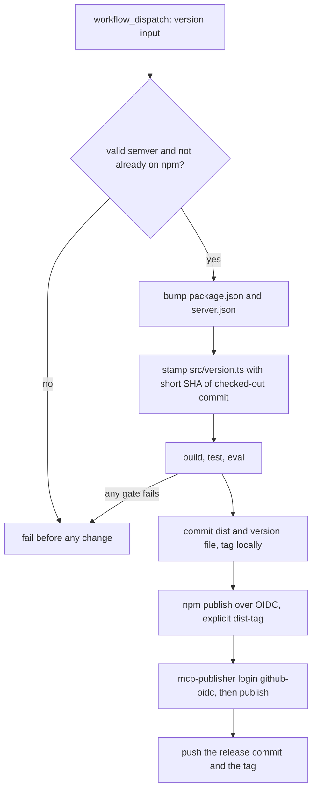
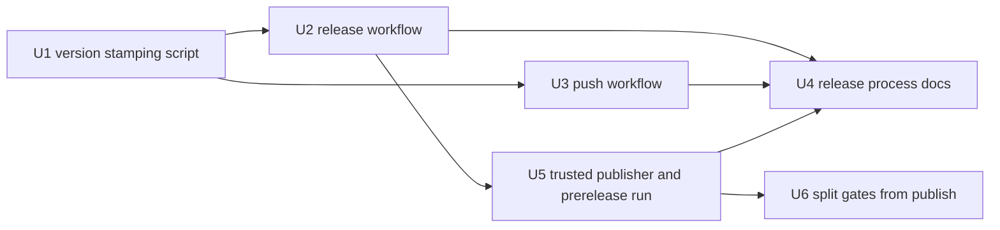

# CI Release Workflow and Commit-SHA Build Identity - Plan

## Goal Capsule

- **Objective.** Move the release from a hand-run checklist into a manually dispatched GitHub Actions workflow, and replace the per-build timestamp in the reported version with the git SHA of the commit that was built.
- **Product authority.** This plan owns the version string reported as `serverVersion`, the way `src/version.ts` is produced, the two new workflow files, and the release checklist prose in `docs/solutions/conventions/release-process.md`. It does not own tool behavior, response shapes, or anything under `src/tools/`.
- **Open blockers.** None. Three forks (who commits `dist/`, npm auth mechanism, whether push CI exists) were settled with the user before planning.
- **Execution profile.** Ship the version-stamping change first and prove it locally; the workflows are only correct once the stamping script they call is correct. The first real release through the workflow is itself a verification step, run against a prerelease version published under a non-default dist-tag so no consumer is moved onto it — but the npm version and the registry entry it creates are permanent, which is the real cost of that rehearsal.
- **Stop conditions.** Stop and report if `main` turns out to carry branch protection that rejects a `GITHUB_TOKEN` push (U2's commit step cannot work without a bypass), or if npm trusted publishing rejects a `workflow_dispatch` publish (U5 falls back to a token and the workflow gains a secret).

---

## Product Contract

### Summary

The release becomes one manual button: a `workflow_dispatch` run takes the new version, bumps it in all three places that must agree, builds from a clean checkout, runs every gate, commits `dist/` plus a version file stamped with the built commit's short SHA, tags, publishes to npm over OIDC, and then publishes to the MCP registry. A second, much smaller workflow runs the same gates on every push so the repository stops depending on a human remembering to. The build timestamp disappears; a local `npm run build` stops rewriting a tracked file.

### Problem Frame

The reported version carries a UTC build timestamp — `2.1.0+20260824203428` — which identifies nothing: it names when a machine ran `tsc`, not what was compiled. The useful fact is the source commit a released build came from, and that is what a consumer reading `serverVersion` out of `ea_get_model_info` cannot currently recover. A commit SHA cannot be written into the commit that contains it, so the timestamp was the substitute available to a local build; a release performed by CI is not under that constraint, because it stamps the commit it checked out and commits the result afterwards.

What this does not fix, and does not claim to: the repository commits `dist/`, so the compiled server changes on ordinary feature commits while `package.json` stays put, and every build between two releases will keep reporting one identical string. Per-build identity for a checkout running at `HEAD` needs a different mechanism, recorded under Deferred to Follow-Up Work.

The substitute costs more than it looks. Every `npm run build` rewrites `src/version.ts` and `dist/version.*`, so the working tree is dirty after any build, and the release checklist has a step whose entire job is to say that this particular dirt is expected. That is a verification signal trained to be ignored — the failure mode the repository already documented once in `docs/solutions/conventions/repair-verification-signals-dont-work-around-them.md`, after the eval step sat dead through two releases.

The release itself is ten manual steps. One of them types the same version string into three fields across two files (`package.json`, `server.json` top level, `server.json` packages entry); the MCP registry rejects the publish when they disagree. Nothing runs automatically on push: not the build, not the 307 tests, not the eval, and not a check that the committed `dist/` matches `src/`.

### Key Decisions

- KD1. **Release identity comes from CI, keyed to the built commit's SHA.** (session-settled: user-directed — chosen over keeping the timestamp, over dropping `dist/` from git, and over deriving the version from git at runtime.) Governs R1, R4.
- KD2. **The dispatched run builds, commits `dist/`, and tags.** (session-settled: user-approved — chosen over "the developer commits `dist/` locally and CI only verifies and publishes": in that split the SHA is stamped by a developer's machine, so nothing actually moves to CI.) Governs R4, R8.
- KD3. **npm publishing authenticates with trusted publishing over OIDC.** (session-settled: user-approved — chosen over an `NPM_TOKEN` secret: no long-lived credential, and provenance is generated automatically. The token path stays documented as the fallback.) Governs R5.
- KD4. **A minimal push/PR workflow ships alongside the release one.** (session-settled: user-approved — chosen over release-only automation: the load-bearing part is the `dist/` drift check, because consumers reading the repository get the committed build directly.) Governs R13, R14.
- KD5. **The SHA is the 7-character short form with a `g` prefix.** (session-settled: user-directed — chosen over the full 40-character hash: `2.1.0+g1a2b3c4` stays readable in a tool response and `git show 1a2b3c4` resolves it.) Governs R1.

### Requirements

**Build identity**

- R1. The version reported as `serverVersion` is the package semver plus the short SHA of the commit the release was built from, in the form `X.Y.Z+g<sha7>`. No timestamp appears in it.
- R2. A local `npm run build` does not modify any tracked file. Running it twice, or running it on a clean checkout, leaves `git status` empty.
- R3. The version published to npm and recorded in `server.json` stays plain semver. Build metadata never enters `package.json`'s `version` field.
- R4. The version file is written by the release workflow from the commit it checked out, not by a developer's machine. The one-time bootstrap in U1, which regenerates the file by hand at the then-current `HEAD`, is the single exception.

**Release automation**

- R5. A manually dispatched workflow performs the release end to end: version bump, build, all gates, `dist/` commit, tag, npm publish, MCP registry publish.
- R6. npm publish authenticates without a long-lived secret.
- R7. The MCP registry publish runs only after the npm publish succeeded, since the registry validates that the npm version exists.
- R8. The release tag points at the commit that contains the built `dist/`.
- R9. The workflow refuses to publish when a gate fails or when the requested version is already on npm. No partial release reaches npm.
- R10. The requested version lands in `package.json` and both `server.json` fields as one operation, so they cannot disagree.
- R11. A run that failed after the npm publish can be finished by a second dispatch, without hand-editing the repository and without republishing to npm.
- R12. The job that holds publishing credentials runs no third-party install, build, or publish lifecycle script.

**Continuous checks**

- R13. Every push and pull request runs build, tests, and eval.
- R14. The same run fails when the committed `dist/` does not match what `src/` compiles to.

**Documentation truth**

- R15. `docs/solutions/conventions/release-process.md` describes the workflow-driven release. Steps the workflow now owns are no longer presented as manual work, and the step that existed only to explain expected build dirt is gone.
- R16. The version-format section states where the SHA comes from and which commit it identifies, including that between releases the suffix names the last released commit — so a checkout running at `HEAD` reports a SHA that is real, resolvable, and not its own.

### Release flow

### Acceptance Examples

- AE1. Clean build.
  - **Covers R2.**
  - **Given** a fresh checkout of `main`.
  - **When** `npm run build` runs twice.
  - **Then** `git status --short` is empty both times.
- AE2. Identity names a real commit.
  - **Covers R1, R4, R8.**
  - **Given** a release dispatched against commit `abc1234`.
  - **When** the published server answers `ea_get_model_info`.
  - **Then** `serverVersion` reads `X.Y.Z+gabc1234`, and `git show abc1234` resolves to the commit whose source was compiled.
- AE3. A failing gate stops the release.
  - **Covers R9.**
  - **Given** a commit whose test suite fails.
  - **When** a release is dispatched for it.
  - **Then** nothing is committed, tagged, or published, and the run reports which gate failed.
- AE4. Version strings cannot drift apart.
  - **Covers R10.**
  - **Given** a dispatch with version `2.2.0`.
  - **When** the run completes.
  - **Then** `package.json`, `server.json`'s top-level `version`, and `server.json`'s `packages[0].version` all read `2.2.0`.
- AE5. Stale `dist/` is caught before a human notices.
  - **Covers R14.**
  - **Given** a commit that changes `src/` without rebuilding.
  - **When** it is pushed.
  - **Then** the push workflow fails on the drift check and names the differing files.

### Scope Boundaries

- Changing what `dist/` is or removing it from git. The committed build stays; KD1 assumes it.
- Publishing on a tag push or on merge. The trigger is manual by intent.
- A Node version matrix, coverage upload, or release notes generation in the push workflow. One job, one Node version.
- Any change to tool behavior, response shape, or tool descriptions. The only observable difference is the `serverVersion` string.
- Automating the npmjs.com trusted-publisher configuration. That is a one-time console step, performed in U5.

### Known limitation, accepted

Between releases, `src/version.ts` on `main` still names the last released commit. Anyone running the repository at `HEAD` rather than at a tag therefore reads a version that is accurate for the last release but not for their checkout. This is strictly better than today — the current timestamp identifies nothing at all — and it is exact for every npm consumer, which is the population that cannot inspect git. A follow-up could report the live SHA when a `.git` directory is present next to the installed package; that is recorded under Deferred to Follow-Up Work rather than built here, because it is a second identity mechanism and this plan's job is to make the first one honest.

### Deferred to Follow-Up Work

- Runtime `.git`-based identity for consumers running the repository at `HEAD` (see Known limitation).
- Chaining a second workflow off the release tag. A `GITHUB_TOKEN` push does not trigger further workflows, so this would need a PAT or GitHub App token — out of scope while there is nothing to chain.
- Tightening the npm package's publishing access so tokens are no longer accepted. Worth doing once OIDC has carried at least one real release, but not before — it is the console action that removes the fallback KD3 deliberately keeps.

### Outstanding Questions

**Deferred, non-blocking**

- Whether `main` carries branch protection that rejects a `GITHUB_TOKEN` push. Not observable from the working copy; U2 verifies it on the first dispatch and the Goal Capsule names it as a stop condition.
- Whether the MCP registry's npm-existence check needs a wait after `npm publish`. No official guidance exists either way; U2 ships a bounded retry rather than assuming instant propagation.

### Sources / Research

External research ran because the repository has no CI patterns to copy and publishing credentials are involved. Findings that shaped decisions:

- npm trusted publishing (OIDC) requires npm ≥ 11.5.1 and Node ≥ 22.14.0 on a GitHub-hosted runner, `permissions: id-token: write`, `actions/setup-node` with `registry-url`, and a per-package trusted-publisher entry naming owner, repository, and **workflow filename**. Provenance is then automatic and `--provenance` must not be passed. `repository.url` in `package.json` must match the GitHub repository, which it already does. Source: https://docs.npmjs.com/trusted-publishers, https://docs.npmjs.com/generating-provenance-statements
- npm's own documentation notes a validation caveat around `workflow_call` and `workflow_dispatch` publishes, where the calling workflow's name is checked instead of the publishing one. A single self-contained dispatch workflow appears unaffected, but this is the one thing to prove first — hence the prerelease release run in U5.
- The MCP registry has no official GitHub Action; the documented CI recipe downloads the `mcp-publisher` release binary and runs `mcp-publisher login github-oidc`, which needs the same `id-token: write` permission. The registry grants `publish` on `io.github.<repository_owner>/*` based on the OIDC `repository_owner` claim, so no secret is involved. Ownership of the npm package is proven by the `mcpName` field, already present. Every official example publishes to npm first. Source: https://github.com/modelcontextprotocol/registry/blob/main/docs/modelcontextprotocol-io/github-actions.mdx
- The MCP registry rejects a duplicate version. `createServerInTransaction` calls `CheckVersionExists` and returns `invalid version: cannot publish duplicate version`, which the publish handler surfaces as HTTP 400; a unique constraint on name plus version backs it at the database level. Publishing is therefore **not** idempotent, and a blind retry of a publish that actually landed fails. The registry's own code notes that a slow multi-package validation can surface to the publisher as a truncated read *after* the commit succeeded — which is exactly when a retry would hit the duplicate rejection. Both the retry and the recovery path must check whether the version is already present instead of assuming a failed response means a failed publish. Source: https://github.com/modelcontextprotocol/registry/blob/main/internal/service/registry_service.go, https://github.com/modelcontextprotocol/registry/blob/main/internal/api/handlers/v0/publish.go
- Build metadata does not survive `npm publish`: `libnpmpublish` runs `semver.clean()` over the manifest version, so `2.1.0+g1a2b3c4` would be stored as `2.1.0`. This is why the SHA lives in a generated module and never in `package.json`. Verified against the locally installed npm.
- For both `workflow_dispatch` and a push, `GITHUB_SHA` is the commit the run checked out, so it equals `git rev-parse HEAD` after a default `actions/checkout`. Source: https://docs.github.com/en/actions/reference/workflows-and-actions/events-that-trigger-workflows
- A `GITHUB_TOKEN` push needs `permissions: contents: write`, works with the credentials `actions/checkout` persists by default, and does not trigger further workflow runs. Branch protection still applies to it. Source: https://docs.github.com/en/actions/how-tos/write-workflows/choose-when-workflows-run/trigger-a-workflow

---

## Planning Contract

### Key Technical Decisions

- **KTD1. Version stamping moves out of `prebuild` into a dedicated script that only the release workflow runs.** Today `prebuild` regenerates `src/version.ts` on every build, which is the sole reason a build dirties the tree. Making the stamp a separate npm script leaves `npm run build` as plain `tsc` everywhere — locally and in CI — which is what makes R2 and the drift check in R14 both trivially true. Without this split, the drift check would need to exclude the version files, and an exclusion is exactly the kind of "ignore that noise" instruction the repository's own learning warns against.

- **KTD2. `src/version.ts` stays a tracked, generated file.** It is the only mechanism that survives `npm publish`, since build metadata is stripped from the manifest version. Keeping it tracked also keeps `dist/version.js` consistent with the rest of the committed build. The file's content is authored by exactly one actor — the release workflow — which is the change from today.

- **KTD3. The stamped SHA identifies the source commit, not the tree that ships.** The workflow checks out commit *N*, stamps `+g<sha of N>`, builds, then commits `dist/` as commit *N+1* and tags that. The version therefore names the commit whose `src/` was compiled, which is the useful fact; the alternative — tagging before building — would leave the tag pointing at a tree without the build, breaking the committed-`dist/` property. This is documented in the release process prose rather than left for a reader to infer.

- **KTD4. The workflow owns the version bump; the dispatch takes it as an input.** The three strings that must agree (`package.json`, `server.json` twice) are written in one step from one input, which removes the checklist's most repeated trap. The alternative — a human bumps and pushes, the workflow reads `package.json` — keeps a manual step whose failure mode is a registry rejection late in the run.

- **KTD5. Every gate runs before anything irreversible, and the remote is touched last.** Order is: reject an already-published version, bump, stamp, build, test, eval, commit and tag locally, publish to npm, publish to the registry, and only then push the commit and the tag. `npm publish` is effectively irreversible after 72 hours and the MCP registry publish cannot be undone, so nothing may be attempted until the local gates are green — and a publish that fails must leave `main` and the tag namespace untouched, so the same dispatch can simply be re-run. A `concurrency` group serializes releases so two dispatches cannot interleave pushes.

- **KTD6. The release job runs on Node 24; the push job runs on Node 22.** The release job needs npm ≥ 11.5.1 for OIDC; the npm version is a property of the Node patch release rather than the major, so the job upgrades npm explicitly instead of inferring the floor from `node-version: 24`. The push job pins the `engines` floor, so the declared minimum is actually exercised rather than asserted. `tsc` output does not vary between the two, so the drift check stays meaningful.

- **KTD7. The MCP publish is guarded by an existence check, then retried a bounded number of times.** npm registry propagation is not instantaneous and no official guidance covers the gap, so a first-attempt failure is not evidence of a broken configuration. But the registry rejects a duplicate version with a 400, and its own slow-validation path can return a failure to the publisher after the write committed — so a blind retry can turn a successful publish into a failed run. Every attempt therefore queries the version-detail endpoint first and treats a version that is already present as success. With that guard the retry is safe: it converts a likely-transient failure into a wait, and an exhausted retry is a real failure.

- **KTD8. The drift check is `npm run build` followed by a diff against the index.** With KTD1 in place, no file is expected to change, so the check needs no exclusion list and its failure output names the offending files directly.

- **KTD9. Publishing credentials and third-party code never share a job.** The gates job installs dependencies and builds; the publish job holds `id-token: write` and `contents: write` and receives the built tree as an artifact. A compromised transitive dev-dependency's install script therefore runs in a job with `contents: read` and no OIDC token. The publish job installs with `--ignore-scripts` and publishes with `--ignore-scripts`, which also makes the published tarball the exact tree the gates passed rather than a `prepublishOnly` rebuild nobody checked.

- **KTD10. The recovery mode is the same workflow with one step removed, not a second workflow.** Because the release commit is created after the gates and pushed after the publishes, a failure between the npm publish and the push destroys the local commit with the runner — but leaves `main` exactly where the failed run found it. Re-dispatching with `resume_after_npm` therefore rebuilds the identical tree from the identical parent (`tsc` output is deterministic) and skips only the already-on-npm rejection and the npm publish itself. The alternative, a separate repair workflow, would duplicate the bump, stamp and build steps that must stay byte-identical to be worth running at all.

### Assumptions

- `main` accepts a push authenticated by `GITHUB_TOKEN`. If branch protection blocks it, U2 is blocked until a ruleset bypass exists for the Actions app — named as a stop condition rather than worked around.
- The repository is public, so provenance generation and free Actions minutes both apply.
- `npm run eval:run` needs no `.qea` export: it builds its own synthetic model into a temp directory, which is what makes it runnable in CI at all. It does need `tsx`, which U1 adds to `devDependencies` so `npm ci` installs it from the lockfile rather than `npx` fetching it from the network on every run.
- No consumer parses the `serverVersion` string. Changing the suffix from a timestamp to a SHA is a reporting change, not a contract change.

### Sequencing

---

## Implementation Units

### U1. Version stamping script and the end of the build timestamp

- **Goal.** `npm run build` becomes a pure compile, and the version string gains a SHA-shaped suffix written by one dedicated command.
- **Requirements.** R1, R2, R3, R4.
- **Dependencies.** None.
- **Files.** `scripts/stamp-version.mjs` (new), `package.json`, `src/version.ts`, `test/version.test.ts` (new).
- **Approach.**
  1. Add `scripts/stamp-version.mjs`, which reads the semver from `package.json`, takes the commit SHA from its first argument or from `GITHUB_SHA`, truncates it to 7 characters, and writes `src/version.ts` with `X.Y.Z+g<sha7>`. It fails with a clear message when no SHA is available, so it can never silently produce a version without one.
  2. Expose it as an npm script (`version:stamp`) and delete the `prebuild` script, so `build` is `tsc` alone.
  3. Add `tsx` to `devDependencies` and change `eval:run` to invoke the local binary instead of `npx`, so the eval gate resolves from the lockfile rather than the network.
  4. Regenerate `src/version.ts` once by hand at the current `HEAD` so the committed value already follows the new shape.
- **Patterns to follow.** The existing inline `prebuild` node script is the behavior being replaced; keep its output shape (a single exported `packageVersion` const) so `src/index.ts` and `src/tools/schema.ts` need no change.
- **Test scenarios.**
  - Covers R1. Given a semver and a 40-character SHA, the script writes exactly `X.Y.Z+g` followed by the first 7 characters.
  - Given no SHA argument and no `GITHUB_SHA`, the script exits non-zero and writes nothing.
  - Given a SHA shorter than 7 characters, the script fails rather than emitting a truncated identifier.
  - The committed `src/version.ts` parses as `<package.json version>+g<7 hex chars>` — this is the assertion that catches a release that forgot to stamp, and a `package.json` bump that never reached the version module.
  - Covers AE1. `npm run build` on a clean tree leaves `src/version.ts` and `dist/version.*` byte-identical.
- **Verification.** `npm run build` followed by `git status --short` shows nothing; `npm test` green.

### U2. Release workflow

- **Goal.** One manual dispatch performs the whole release, or fails before changing anything.
- **Requirements.** R4, R5, R6, R7, R8, R9, R10, R11.
- **Dependencies.** U1.
- **Files.** `.github/workflows/release.yml` (new).
- **Approach.**
  1. Trigger on `workflow_dispatch` with a required `version` input and an optional boolean `resume_after_npm` input; add a `concurrency` group so releases serialize.
  2. Job permissions: `contents: write` for the commit, tag and push; `id-token: write` for both OIDC exchanges. The job declares `environment: release`, whose deployment-branch policy allows only `main` — npm's trusted-publisher entry binds to owner, repository and workflow filename, not to a branch, so without the environment anyone able to push a branch carrying a modified `release.yml` at the same path could dispatch it and publish under this package's name with valid provenance.
  3. Check out the repository, set up Node 24 via `actions/setup-node` with `registry-url` pointing at the npm registry, then upgrade npm explicitly so the OIDC floor of 11.5.1 is enforced rather than inherited from the Node major. Third-party actions are referenced by full commit SHA with the version in a trailing comment.
  4. Guard first, before any file is touched: reject a version that does not parse as semver, reject a version already present on npm, reject a version whose tag already exists, and reject a dispatch whose checked-out `GITHUB_SHA` is not the current tip of `main`. The `version` input reaches every `run:` step through an `env:` mapping and is referenced as a quoted shell variable — never interpolated as `${{ inputs.version }}` into a script body, which would execute before the semver check could reject it.
  5. Bump with `npm version <input> --no-git-tag-version`, which writes `package.json` and both `package-lock.json` version fields, plus the two `server.json` fields in the same step; then stamp `src/version.ts` from `GITHUB_SHA`.
  6. Run `npm ci`, `npm run build`, `npm test`, `npm run eval:run`. Any failure ends the run here.
  7. Commit `dist/`, `src/version.ts`, `package.json`, `package-lock.json` and `server.json` under an explicit bot identity and create the tag — locally only. Nothing is pushed yet.
  8. `npm publish` with no token and no `--provenance` (trusted publishing supplies both), passing an explicit dist-tag: `--tag next` when the dispatched version carries a prerelease identifier, `--tag latest` otherwise. Without it npm assigns `latest` to every publish regardless of the semver, so a rehearsal would move every `npx` consumer onto an unproven build. Then download `mcp-publisher` pinned to an explicit release tag, verify its published checksum before executing it, and run `login github-oidc` and `publish` — the MCP step wrapped in the existence-checked bounded retry from KTD7, so a version the registry already carries is reported as done rather than republished into a 400. Note that `prepublishOnly` rebuilds and retests during the publish; that is harmless once `build` is a pure compile, but it means the publish step must run after the stamp, never before it.
  9. Push the release commit and the tag only after both publishes have succeeded, so a publish failure leaves the remote untouched and the same dispatch is simply re-runnable.
  10. When `resume_after_npm` is set, two things change and nothing else does: the already-on-npm rejection in step 4 is inverted — the version must be present, or the dispatch is refused — and the `npm publish` in step 8 is skipped. Bump, stamp, gates, commit, tag, registry publish and push all run exactly as before, reproducing the tree the failed run built from the same parent commit.
- **Patterns to follow.** The step order mirrors the existing checklist in `docs/solutions/conventions/release-process.md`; where the two disagree after this unit, the workflow is authoritative and U4 corrects the prose.
- **Recovery.** A failure after step 8 destroys the release commit with the runner, but leaves `main` and the tag namespace untouched — which is what makes recovery a dispatch rather than hand surgery. Both partial states are finished the same way: re-dispatch the same version with `resume_after_npm` set. If the registry publish was the step that failed, the resumed run publishes it and pushes. If both publishes succeeded and only the push failed (branch protection, or `main` moved between checkout and push), the registry step's existence check reports the version as already present, skips it, and the run pushes. Never re-dispatch without the flag — the npm guard will reject it, correctly.
- **Execution note.** The npmjs.com trusted-publisher entry from U5 step 1 must exist before this workflow is dispatched for the first time, otherwise the run reaches the publish step and fails there. Prove the workflow with a prerelease version before a real one — the first run is the only place several of these assumptions (branch protection, OIDC acceptance, registry propagation) can be tested at all.
- **Test scenarios.**
  - Covers AE3. A dispatch against a commit with a failing test produces no commit, no tag, and no publish.
  - Covers AE4. After a successful run, all three version fields read the dispatched value.
  - Covers AE2. The tag points at a commit containing `dist/`, and `src/version.ts` in that commit names the parent commit's short SHA.
  - A dispatch for a version already on npm fails at the guard step, leaving the branch untouched.
  - A dispatch from a ref that is not the current tip of `main` fails at the guard step.
  - Covers R11. A dispatch with `resume_after_npm` set for a version that is *not* on npm fails at the guard step, so the flag cannot be used to skip a publish that never happened.
  - Covers R11. A resumed dispatch for a version the registry already carries skips the registry publish and proceeds to the push, rather than failing on the duplicate rejection.
  - Covers R7. When the npm publish step fails, the MCP registry step does not run and nothing is pushed.
  - Test expectation: no unit tests — a workflow's behavior is only observable by running it. Verification is the prerelease dispatch in U5.
- **Verification.** The workflow file is committed and its guard step rejects a version already present on npm. The end-to-end proof — a dispatched run completing through both publishes with tag, npm version and registry entry agreeing — belongs to U5, which owns the trusted-publisher configuration that run depends on.

### U3. Push and pull-request workflow

- **Goal.** The gates that today depend on a human remembering run on every push, including one the checklist can only ask a human to eyeball.
- **Requirements.** R13, R14.
- **Dependencies.** U1.
- **Files.** `.github/workflows/ci.yml` (new).
- **Approach.**
  1. Trigger on `push` and `pull_request`; one job, Node 22, `permissions: contents: read`. Third-party actions are referenced by full commit SHA with the version in a trailing comment.
  2. `npm ci`, `npm run build`, `npm test`, `npm run eval:run`.
  3. Drift check: after the build, fail when the working tree differs from the index, reporting the differing paths. With U1 shipped this needs no exclusions.
- **Test scenarios.**
  - Covers AE5. A branch whose `src/` changed without a rebuild fails the drift check and names the stale `dist/` files.
  - A branch with a rebuilt, committed `dist/` passes.
  - Covers R13. A branch with a failing test fails the run, and the eval step runs independently of the unit tests so an eval regression is not masked by a green suite.
  - Test expectation: no unit tests, same reason as U2 — verified by pushing a branch.
- **Verification.** A deliberately stale-`dist/` branch fails; a clean branch passes.

### U4. Release process documentation

- **Goal.** The checklist describes the release that now exists, and the version-format section explains what the SHA identifies.
- **Requirements.** R15, R16.
- **Dependencies.** U2, U3, U5.
- **Files.** `docs/solutions/conventions/release-process.md`.
- **Approach.**
  1. Replace the ten manual steps with the dispatch, and keep only what a human still does: decide the version per the existing bump criteria, and watch the run.
  2. Delete the step that exists to explain expected build dirt — after U1 there is none, and the surrounding `.gitattributes` note belongs with the drift check instead.
  3. Rewrite the version-format section: the suffix is the short SHA of the commit the release was built from, supplied by CI, and is deliberately absent from the published `package.json` because npm strips build metadata. State plainly that between releases the suffix keeps naming the last released commit, so a checkout running at `HEAD` reports a SHA that resolves to a real commit that is not the one it is running.
  4. Record the npm trusted-publisher configuration, the release environment's branch restriction, and the token fallback, so a future maintainer can re-establish publishing without rediscovering it.
  5. Record U2's recovery procedure: a failed run leaves `main` untouched, and both partial states are finished by re-dispatching the same version with `resume_after_npm` set.
- **Test scenarios.** None; documentation carries no assertions. Each claim is checked against the shipped workflow files.
- **Verification.** Every step in the document is either performed by a workflow that exists or by a human, and no step describes work that no longer happens.

### U5. Trusted publisher configuration and prerelease release run

- **Goal.** Publishing works without a stored secret, proven end to end before a real version depends on it.
- **Requirements.** R6.
- **Dependencies.** U2.
- **Files.** None in the repository — this is a registry-side configuration plus one workflow run.
- **Approach.**
  1. Before U2 is dispatched for the first time: on npmjs.com, add a trusted publisher for `enterprise-architect-mcp` naming the owner, the repository, the release workflow filename, and the `release` environment. The filename must match `.github/workflows/release.yml` exactly; npm does not validate the entry until a publish attempts to use it. Create the matching GitHub `release` environment with a deployment-branch rule limiting it to `main`.
  2. Dispatch the release workflow with a prerelease version and confirm: the npm publish succeeds without a token, it landed on the `next` dist-tag rather than `latest`, provenance appears on the published version, and the MCP registry accepts the publish.
  3. If OIDC is rejected for a dispatch-triggered publish, fall back to an `NPM_TOKEN` secret with `--provenance --access public`. The token must be a granular access token scoped to this package with publish-only permission and an expiry of at most 90 days, stored as a secret on the `release` environment; record in U4's document that the fallback is in use, why, and the trigger for retrying OIDC and revoking it.
- **Test scenarios.** Test expectation: none — this is configuration and a live run, and that run is itself the test. Note that it is not a rehearsal in the reversible sense: the npm version and the registry entry it creates are permanent.
- **Verification.** A prerelease version is on npm under a non-default dist-tag with a provenance attestation, present in the MCP registry, and no publishing secret exists in the repository settings.

### U6. Split the release into a gates job and a publish job

- **Goal.** The credentials that can publish under this package's name are never in scope while third-party code executes.
- **Requirements.** R12.
- **Dependencies.** U5.
- **Files.** `.github/workflows/release.yml`.
- **Approach.**
  1. Move the guard, bump, stamp, install, build, test and eval steps into a gates job with `permissions: contents: read`, no `id-token`, and no environment. It ends by uploading the bumped, built tree as a workflow artifact.
  2. Give the publish job `needs:` on the gates job, `environment: release`, `contents: write` and `id-token: write`. It downloads the artifact, installs with `--ignore-scripts`, commits and tags locally, publishes to npm with `--ignore-scripts`, publishes to the registry, and pushes.
  3. Publishing with `--ignore-scripts` supersedes U2's note about `prepublishOnly`: the tarball becomes exactly the tree the gates passed, instead of a rebuild performed inside the credentialed job and checked by nobody.
- **Patterns to follow.** Step order and semantics are unchanged from U2 — this unit moves steps between jobs, it does not add or remove any. No claim in U4's document changes.
- **Execution note.** This lands after U5 deliberately. Folding it into U2 would put an artifact handoff and an untested publishing path into the same first dispatch, so a failure would not say which of the two caused it.
- **Test scenarios.**
  - Covers R12. The gates job declares no `id-token` permission, so an install script running there cannot mint an OIDC token.
  - The publish job's log shows no npm lifecycle script running.
  - A prerelease dispatch still completes end to end, and the published tarball's contents match the artifact the gates job produced.
  - Test expectation: no unit tests, same reason as U2 — verified by dispatching.
- **Verification.** A prerelease dispatch completes across both jobs, and the version published from the artifact is byte-identical to the tree that passed the gates.

---

## Verification Contract

- `npm run build` — TypeScript compilation. After U1, a clean tree stays clean across it; that property is itself a gate.
- `npm test` — the full Jest suite, 12 suites and 307 tests at plan time. U1 adds a suite; the count must not fall.
- `npm run eval:run` — 27 synthetic-model tasks, all passing. Runs with no arguments and no export, which is why it can run in CI.
- `git status --short` after a build — must be empty. This replaces the old checklist step that enumerated which dirt to ignore.
- A prerelease dispatch of the release workflow — the only verification that covers OIDC acceptance, branch-protection interaction, and registry propagation. Nothing else can prove those.
- No new runtime dependency. The stamping script uses Node built-ins; `tsx` joins `devDependencies` so the eval gate stops resolving from the network; the workflows use `actions/checkout` and `actions/setup-node`, both referenced by full commit SHA.

## Definition of Done

**Global**

- `serverVersion` reads `X.Y.Z+g<sha7>` and no timestamp exists anywhere in the build.
- `npm run build` leaves the working tree clean.
- A release is performed by dispatching one workflow; no step of it is performed by hand except choosing the version.
- npm publishing uses no stored secret, or the document states why the token fallback is in use.
- `npm run build`, `npm test`, and `npm run eval:run` all pass, with suite and task counts no lower than at plan time.
- Per the repository's release process, replacing the version suffix and adding release automation is a minor bump — the bump belongs to the first release run through the new workflow, not to these commits.

**Per unit**

- U1 — `prebuild` is gone, `scripts/stamp-version.mjs` exists, `tsx` is a declared dev dependency, and a test pins `src/version.ts` to `package.json`'s semver.
- U2 — a dispatched run either completes through both publishes and then pushes, or fails leaving the remote untouched; every third-party action is pinned to a commit SHA.
- U3 — a stale-`dist/` branch fails CI, the check needed no exclusion list, and every third-party action is pinned to a commit SHA.
- U4 — every claim in the release document is true of the shipped workflows, the recovery procedure is written down, and the expected-dirt step no longer exists.
- U5 — a prerelease version is live on npm under a non-default dist-tag with provenance and present in the MCP registry.
- U6 — the job holding `id-token: write` runs no third-party install, build, or publish lifecycle script, and the published tarball is the artifact the gates job produced.
