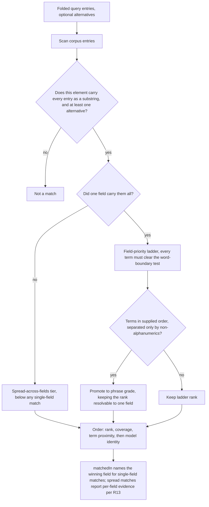

# Multi-Term Search, Match Evidence and Narrowing in ea_search - Plan

## Goal Capsule

- **Objective:** Make `ea_search` answer in one call what today takes several — by showing why each result matched, by letting a caller narrow to a module, and by letting one call carry several terms.
- **Product authority:** This plan owns the matching semantics, the ranking algorithm, and the parameter surface of `ea_search`. It does not own `ea_resolve` or `ea_list_diagrams`, whose matching rules stay as they are.
- **Execution profile:** Three stages, released and measured separately per KD12. U10 is shared measurement infrastructure and comes first; U1–U6 are Stage 1, U7–U9 are Stage 2, and Stage 3 is planned only after Stage 2 ships. Ordering is load-bearing: a stage's baseline must be captured before that stage merges.
- **Stop conditions:** Stop before merging any stage whose baseline has not been recorded. Stop before planning Stage 3 — its shape depends on an open question and on Stage 2's measurement. Stop before editing any version field; the release workflow owns those.
- **Open blockers:** None for Stages 1 and 2. Stage 3 carries one, recorded below as blocking.

---

## Product Contract

### Summary

Three changes to `ea_search`, released in stages. Each result reports the evidence for its match — which field, which attribute, which terms and the surrounding text — so a caller can tell why a result is there without fetching the element. A package scope and a package breakdown axis let an over-broad result be narrowed instead of paged. And `query` widens from one string to a list of strings, each entry matched as a contiguous substring exactly as the single string is today, so one call can carry several terms; because matching is substring containment rather than tokenisation, an entry carrying whitespace is already a phrase, so nothing is split and no phrase argument is needed. Terms need not share a field, but sharing one ranks higher. Only the last change alters the argument shape, and it alone ships as a major version.

### Problem Frame

`ea_search` folds the whole query into one string and tests it as a single contiguous substring against each corpus entry. A query naming two things therefore matches nothing unless those two things happen to sit adjacent in the source text.

Agents work around this by decomposing the query themselves. The observed behaviour that prompted this work was an agent issuing several single-term searches in sequence, each with a hand-truncated word stem, and reassembling the answer from the results. The stem truncation is correct — substring matching means `škol` reaches `školu`, `školy` and `školský`, and the agent knows it. The failure is that there is nowhere to put the second word.

Reassembly outside the server does not scale. A common query against a production model matches roughly 12,000 elements, and the response window is 25 rows, so intersecting two such result sets client-side costs hundreds of round trips per term. Conjunction has to happen where the corpus is, or it does not happen.

That was one episode. A second, recorded while this plan was being written, points somewhere else. A question about the difference between two coded types cost one search and two element fetches — and the search found the right elements on its first call. Conjunction would have saved nothing. What cost the extra calls was that the response named a source table and a field but never said which attribute matched or what it said.

The same weakness hides work already done. Asked what interface it would need for that question, an agent requested that attribute notes be searched and that results be grouped under one element. `ea_search` has always done both. The agent could not tell, because nothing in the response showed them working.

So `ea_search` is expensive for at least three separate reasons: a call cannot carry two criteria, it cannot be narrowed to a module, and it does not show why a result matched. Only the first was in view when this plan opened. It addresses all three now, in stages, rather than treating the first as the whole problem.

The boundary was anticipated. The design note that chose substring-plus-ladder ranking over FTS5 lists needing "phrase matching, proximity, or boolean operators" among its upgrade triggers ([docs/solutions/design-patterns/like-relevance-ranking-over-fts5.md](docs/solutions/design-patterns/like-relevance-ranking-over-fts5.md)). This is that trigger arriving.

### Key Decisions

- KD1. **Prefer every term inside one field rather than requiring it.** An element whose terms are satisfied only by combining separate fields still matches, but ranks below one carrying them together. (session-settled: user-directed — chosen over admitting cross-field matches at a lower rank: the extra recall was not worth generalising `matchedIn` into a per-term breakdown.) **Reversed 2026-09-01.** The annotation names the option now taken, and the cost it weighed against is absorbed rather than avoided: R13 adds per-match evidence alongside the single `matchedIn`, which is exactly the per-term breakdown that made cross-field look expensive, and KD11 argues against withholding a result the caller could judge for itself. The observed case that forced the question had its answer spread across sibling attributes of one element, so the single-field rule found that element only because an unrelated field happened to mention the terms together. Governs R1, R7, R12.
- KD2. **Freeze single-term behaviour.** The multi-term algorithm must reduce to today's algorithm when one term is supplied, so the existing rank ladder and its ordering guarantees carry over intact. Governs R3.
- KD3. **Preserve phrase matching as a first-class capability.** An agent holding an exact element name must be able to find other references to that text. Matching is substring containment rather than tokenisation, so an entry carrying whitespace already is a phrase and needs no argument of its own. (session-settled: user-directed — chosen over letting whitespace-splitting subsume phrases: contiguous-substring search is a distinct retrieval need, not a degenerate conjunction.) Governs R2, R8.
- KD4. **Express disjunction structurally, not syntactically.** A flat text syntax for OR needs precedence and parentheses, which needs a parser; two separate argument lists express one level of nesting with neither. Governs R4.
- KD5. **Treat a phrase as an unbreakable term, not a mode.** An entry carrying whitespace narrows the result alongside the other entries rather than switching behaviour, so no combination of arguments silently discards input. (session-settled: user-directed — chosen over rejecting the combination as ambiguous: a rejected call teaches the agent nothing it can act on mid-task.) Governs R2.
- KD6. **Add no new search infrastructure.** (session-settled: user-directed — chosen over embeddings and FTS5: the failing query is a lexical conjunction, which vector similarity does not answer, and a read-only external export has nowhere to persist an index.)
- KD7. **Widen `query` into a list of strings rather than adding a second argument.** Every entry is a contiguous substring, so one list carries terms and phrases alike and the conjunction needs neither a new parameter nor whitespace splitting. (session-settled: user-directed — supersedes the earlier plan to build two candidate parameter surfaces and choose between them by measurement. Those surfaces existed only to decide where whitespace splitting should happen, and this decision removes splitting altogether.) Governs R15.
- KD8. **Ship the list-valued `query` as a major version rather than accepting both shapes.** Also accepting a string would keep the silent single-string path alive and invite callers to send the wrong shape; a list-only argument rejects the old form with a validation error instead. MCP callers are handed the tool schema on every call rather than compiling against it, so the new contract propagates without a migration path. (session-settled: user-directed.) Governs R15, R16.
- KD9. **Score correctness as a gate and call count as the result.** (session-settled: user-directed — chosen over pure success rate or ranking position: the observed pain was the number of calls, and ranking position cannot discriminate between surfaces that share an engine.) Governs R19. **Reaffirmed 2026-09-02, gate tightened in practice.** A call-count delta was twice read as a verdict without the correctness half being checked for that specific comparison — once for U5 (a subagent's grading of an anomaly was trusted without reading the full transcript, and was wrong), once live during U9's deep-dive (claude-sonnet-5's higher call count under Stage 1+2 on B1/B4 was flagged as a regression before checking whether the extra calls bought a more complete answer). The gate is the load-bearing half, not a formality the call-count number can outrun; a call-count delta is not itself a finding until the paired correctness check for that same comparison has actually been done. Direct evidence the gate matters: `gpt-5-mini` carried the lowest call count of all six models specifically because it skips verification and hallucinates (invents a "supplier registry" rule on B1, a `t_glossary` table on B2) rather than because it retrieves efficiently.
- KD10. **Return the evidence for a match, not just the fact of it.** A result naming only a source table and field leaves the caller unable to tell why it matched, so it must fetch the element to find out; naming the attribute and quoting the matched text answers in the same call. Missing evidence also hides capabilities that already exist: the same agent asked for attribute notes to be searched and for results to be grouped under one element, both of which `ea_search` has done all along, because nothing in the response showed them working. A capability that leaves no trace in the response is indistinguishable from a missing one. (session-settled: user-directed — raised by an agent asked what interface it would need to answer a real modelling question, and reproduced in session, where one question cost one search and two element fetches even though the search found the right elements on its first call.) Governs R13, R14, R19.
- KD11. **The tool retrieves and evidences; it does not interpret.** `ea_search` answers which text matched and where, and leaves what that means to the caller. This is why the response gains match evidence rather than a synthesised summary, and why the ranking signals stay mechanical — field priority, coverage, proximity — rather than modelling relevance. Deliberately left unlabelled, and the omission is the decision: this principle is an input to the blocking question about the second list, so freezing it would answer that question by the back door. It is decided on Stage 2's evidence along with the question it feeds. Governs R13, R14, and constrains the shape chosen for the second list.
- KD12. **Deliver in stages, each released and measured on its own.** The work carries three independent changes, and a single measurement could not attribute an improvement to any one of them. Match evidence ships first, because it makes behaviour the server already has observable and so makes every later baseline truthful; narrowing ships second; the multi-term matching and the list-valued `query` ship last, as the only major version. (session-settled: user-directed — chosen over one release: no date forces the work, so correct attribution outranks shipping at once.) Governs the delivery stages below.

### Delivery Stages

Each stage is independently releasable and measured on its own, per KD12. A stage's baseline is captured after the previous stage has shipped, so each stage's number is the marginal effect of that stage given everything already released — not an independent attribution. That is what the staging buys and the limit of what it buys: U5's and U9's records name the released baseline the number is conditioned on.

- **Stage 1 — match evidence.** R13, R14, R14a, and R17 as it applies to this stage. Additive response fields plus one correction to `NotePreview`, minor version. First, because it makes behaviour the server already has observable: until a result says why it matched, an agent works around capabilities it cannot tell exist, and every baseline measures that misunderstanding rather than the tool.
- **Stage 2 — narrowing.** R21, R22, and R17 as it applies to this stage. An additive parameter and an additive breakdown axis, minor version. Saves paging rather than searching, which only R19's all-calls metric can see.
- **Stage 3 — multi-term matching.** R1 through R12, and R15 through R17. The conjunction, the cross-field rank tier and the list-valued `query`. The only major version, because R15 rejects the old argument shape.

R18, R19 and R20 apply to every stage, each against its own baseline.

Stage 1 was written as a spike before this plan carried an implementation section, and is parked on the local branch `wip/stage-1-match-evidence`. It satisfies R13, R14 and R14a and passes the suite, but it is held off `main` for one reason: R19 measures a stage against the behaviour that preceded it, and merging would destroy the baseline it has to be measured against. `main` at `148b51d` is therefore the Stage 1 baseline. The branch is a holding place, not a proposal — once the plan reaches the point where its work is scheduled, the work moves onto a real implementation branch and this one is deleted rather than merged.

### Requirements

**Matching semantics**

- R1. An element matches when every supplied term occurs somewhere in its searchable text. The terms need not share a field; carrying them in one is a ranking preference, per R7, not a condition of matching.
- R2. Every term is matched as a contiguous substring after case- and diacritic-folding, exactly as the current single `query` string is. A term carrying whitespace is therefore a phrase, and no supplied term is ever split.
- R3. A one-entry `query` list produces exactly today's result set in today's order for that string, including strings containing whitespace.
- R4. A caller can supply a set of alternatives of which at least one must match, combined with the required terms as `(all required) AND (at least one alternative)`. Every call carries at least one required term. The satisfied alternative need not share a field with them, following R1.
- R5. The number of entries accepted in one call is capped at a small fixed limit, counting required terms and alternatives together.
- R6. A response with no matches reports, per supplied term, whether that term matched anywhere in the corpus, so the caller can tell which term emptied the result rather than guessing.

**Ranking**

- R7. Ranking follows the existing field-priority ladder, generalised so that a rank depending on word-boundary position requires every term to satisfy it. An element carrying every term in one field ranks above one whose terms are spread across fields, so the single-field rule survives as a preference rather than a filter.
- R8. Terms occurring in the supplied order, separated only by non-alphanumeric characters, rank as a phrase-grade match.
- R9. Within the single-field tier, phrase-grade promotion keeps every rank resolvable to one source table and field, so promotion cannot make the reported match field depend on corpus scan order. The cross-field tier has no such field to report and relies on R13's per-match evidence instead.
- R10. Multi-term matches sharing a rank are separated by a term-proximity signal before the tiebreak falls through to model identity.
- R11. Ordering remains deterministic and stable across pages — ties resolve by match coverage, then by the R10 proximity signal, then by the model's internal identity.
- R12. Where every term matched in one field, the response names that field as it does today. Where they are spread, the per-match evidence required by R13 names each field that supplied a term.

**Response**

- R13. Each result reports the evidence for its match: the field that matched, the name of the specific attribute, operation or constraint when the match came from one rather than from the element itself — with its source id where the row carries one, which constraint rows do not, per KTD4 — which of the supplied terms matched there, and a snippet of the source text surrounding the match. Evidence is a collection nested in the result, not a second dimension of the result list, because one row per element is what makes `offset` mean elements rather than hits. It carries `totalMatched`, `returned` and `truncated` under the result's own `_meta`. This is the server's first `_meta` inside a result row — every other one sits at the response root — so the nested-collection precedent covers the field names, not the placement. The term list is deferred to the stage that introduces several terms; until then it would repeat one word in every entry.
- R14. The snippet is drawn from the original text rather than the folded text used for matching, so it reads as the model author wrote it. It is located by word index, not character offset: no transformation in `foldText` creates or removes whitespace, so the k-th word of the folded text is the k-th word of the original, and no index map is needed. The snippet must therefore be cut from the same decoded text the corpus was folded from.
- R14a. `NotePreview` centres on the match when the element's own note is what matched, instead of always starting at the beginning of the note. Left as it is, it reports text unrelated to the reason the element was returned, and an agent has been observed dismissing a correct result on that basis. Where the match came from elsewhere, it continues to preview the note from its start, and the evidence required by R13 names the field responsible.

**Parameter surface**

- R15. `query` accepts a list of strings and no longer accepts a bare string. A bare string is rejected by schema validation rather than coerced into a one-entry list, so the old shape can never silently return a different result set than it did before.
- R16. The change ships as a major version, with a changelog entry naming the old and new shapes.
- R17. The tool description names each stage's new surface — in Stage 1 the match evidence, in Stage 2 the package scope and the package breakdown axis, in Stage 3 the list shape, the conjunctive default and the second list — because the description contract test does not force parameters to be documented.

**Measurement**

- R18. The eval fixture and the agent-tasks rubric gain cases exercising each stage's new capability; for Stage 3 that includes cases that cannot be answered by a single term and at least one exercising the second list. New fixture rows use vocabulary disjoint from the terms the existing eval cases assert on, and the R3 comparison runs against a baseline captured before the fixture grows.
- R19. The agent-tasks rubric is run against the shipped surface and against the current server, recording per task whether the agent reached the correct answer and how many tool calls of any kind it took. A task counts as answered correctly when every fact marked [REQUIRED] in [eval/agent-tasks.md](eval/agent-tasks.md) appears in the agent's final answer; BONUS facts are excluded from the verdict, so two people scoring one transcript reach the same median. Counting every call rather than `ea_search` calls alone is what lets the match evidence required by R13 register at all, since it saves follow-up element fetches rather than searches. The median is computed over the tasks both answered correctly, and each side's correctness count is reported alongside it.
- R20. Each run records the position of the expected element in the result window, as a regression signal on the matching engine.

**Narrowing**

- R21. `ea_search` accepts a package scope, given as a package id or name, and returns only elements within that package's subtree.
- R22. `breakdown` gains a package axis alongside the existing `objectType` and `stereotype` ones, so an over-broad result reports which packages hold the matches. The axis counts an element under its immediate package, while R21's scope covers a package and its descendants, so scoping to a listed package returns at least that package's reported count and generally more. The caller can then narrow with R21 without first walking the package tree, which is what keeps narrowing from costing the call it saves.

### Ranking pipeline

### Acceptance Examples

- AE1. Terms sharing one field outrank terms spread across fields.
  - **Covers R1, R7, R12.**
  - **Given** an element named `Prihláška` whose note reads `žiadateľ podal žiadosť` and whose attribute is named `skolskyRok`, and a second element whose note alone reads `prihláška na školský rok`.
  - **When** the caller searches for the terms `prihláška` and `škol`.
  - **Then** both are returned, the second ranks above the first, and the first's match evidence names both fields that supplied a term.

- AE2. Adjacency promotes a phrase-shaped hit.
  - **Covers R8.**
  - **Given** an element named `Založenie zmluvy` and another named `Založenie dodatku k zmluve`.
  - **When** the caller searches for the terms `založenie` and `zmluv`.
  - **Then** the first element ranks above the second.

- AE3. One term behaves exactly as it does today.
  - **Covers R3.**
  - **Given** the existing eval cases that search for a single word.
  - **When** each runs against the multi-term implementation as a one-entry list.
  - **Then** the returned elements and their order are identical to the current results.

- AE4. The disjunctive leg narrows rather than widens.
  - **Covers R4.**
  - **Given** a coded type family, where short codes `CP`, `NP` and `GR` qualify the shared noun `pohľadávka` and each code sits alongside that noun in a single attribute note.
  - **When** the caller requires `pohľadáv` and offers `CP` and `NP` as alternatives.
  - **Then** the `CP` and `NP` elements are returned and the `GR` one is not.

- AE5. A multi-word entry and a single-word entry together narrow the result.
  - **Covers R2.**
  - **Given** one element whose note contains both `záväzok voči štátu` and `účtovná evidencia`, and another whose note contains only `záväzok voči štátu`.
  - **When** the caller supplies `query` as `["záväzok voči štátu", "účtov"]`.
  - **Then** only the first element is returned, and the multi-word entry is matched contiguously rather than split into two terms.

- AE6. A missing term excludes the element.
  - **Covers R1.**
  - **Given** an element named `Prihláška` with no occurrence of `škol` anywhere in its searchable text.
  - **When** the caller searches for both terms.
  - **Then** the element is absent from the results.

- AE7. The old argument shape fails loudly.
  - **Covers R15.**
  - **Given** a caller sending `query` as the bare string `záväzok účtov`.
  - **When** the call reaches the server.
  - **Then** it fails schema validation and returns no results, rather than being coerced into a one-entry list or split into two terms.

### Success Criteria

- Every existing eval search case passes unchanged against a baseline captured before the fixture grows, demonstrating the frozen single-term behaviour required by R3. R15 rejects every bare string, not only multi-word ones, so the conversion covers all 29 bare-string `ea_search` calls in [test/](test) — including the sample calls in [test/description-contract.test.ts](test/description-contract.test.ts) and [test/response-contract.test.ts](test/response-contract.test.ts) — and all 5 in [eval/tasks.json](eval/tasks.json). Each returns the same elements, ids and breakdown totals once its string is passed as a one-entry list, because a one-entry list is matched exactly as the string was.
- The agent-tasks rubric run against the shipped surface uses fewer tool calls per task than the same tasks run against the current server, measured over the tasks both answered correctly, per R19.
- Ranking quality is tracked as the position of the expected element in the result window, recorded per R20 as a regression signal on the matching engine. A position regression beyond the tolerance set in planning blocks the release, so the signal gates rather than merely reports.

**2026-09-02, where each stage stands against this criterion.** Stage 1 meets it: the isolated `12fccc3`-vs-`148b51d` measurement showed a real improvement for `claude-sonnet-5` and no regression for the other five models, with no correctness cost once the unrelated `ea_get_scenarios` bug was fixed. Stage 2 does not clearly meet it on the tasks tested: once that same bug's masking effect was removed, B1 showed no measurable Stage 2 effect for either model re-verified, and B4's small cost delta traced to no identifiable mechanism across five hand-inspected transcripts — `packageScope` was never invoked, so the delta cannot be attributed to the feature itself. This may say more about the instrument than the feature: the synthetic eval model is small enough that a query rarely returns the over-broad result set narrowing exists to fix (the plan's own Dependencies section cites production-scale figures — ~230,000 corpus entries, a common query matching ~12,000 — that this eval fixture does not approximate), so an eval task set built around specific known elements may simply never exercise the case Stage 2 targets. Absence of a measured win here is not evidence Stage 2 lacks value at production scale, only that this instrument didn't detect one.

**Confirmed directly against a real production-scale export, same day.** Connected the built server directly (no agent, no LLM involved, aggregate numbers only — file size and counts, no business content) to a real export roughly 660MB in size. A generic single-word query returned 12,971 matches, matching the plan's own "~12,000" figure almost exactly. Its package breakdown showed matches scattered across nearly 4,000 distinct packages — even the top 20 visible packages covered only ~12% of all hits. Scoping to the single top-ranked package cut the result from 12,971 to exactly 250 — a 98% reduction, confirmed by direct measurement rather than estimation. This settles the caveat above: Stage 2's narrowing mechanism works exactly as designed at production scale; the eval model's small size is confirmed as the reason U9 couldn't detect a benefit, not a sign the feature lacks one. Follow-up (not yet done): extend the synthetic eval fixture with enough scale/duplication to exercise this case in the committed suite, so future measurement doesn't need a real export to confirm it.

### Scope Boundaries

- Ranking a cross-field match as highly as a single-field one. Cross-field matches are returned, per R1, but R7 keeps them below — the recall is worth having, the equal standing is not.
- FTS5, a tokenised inverted index, or any other persisted index. An exact-token index would break the stem-truncation behaviour agents already rely on, and a prefix index to restore it is FTS5 by another name.
- Embeddings or semantic similarity, per KD6.
- Parentheses, precedence, or any boolean nesting beyond the single level in R4.
- Disjunctions whose legs share no required term. Two sibling concepts that a model treats as one family but names with no word in common — observed in a production model, where an element's own note enumerates them together — cannot be expressed, because R4 requires at least one term common to every result. Two calls remain the answer there.
- Composing conjunctions by passing a candidate element-ID set between calls. It still costs two round trips and the ID list can reach five figures.
- A separate phrase argument. Matching is substring containment, so a `query` entry carrying whitespace is already a phrase; a second argument would only be needed to undo a whitespace split the design does not perform.
- Aligning `ea_resolve` and the `nameContains` filter on `ea_list_diagrams` to the new matching semantics. Both keep their current rules; revisit once the new `ea_search` surface has shipped.
- A general agent-evaluation framework, and a matrix wider than the question needs. U10 exists to answer R19 for this plan's stages; it counts tool calls against a fixed task list and stops there. The model matrix is bounded by KTD8's own argument rather than by ambition — it is as wide as it takes to separate the two failure modes, and no wider.

### Dependencies / Assumptions

- The corpus-scale figures motivating server-side conjunction — roughly 230,000 corpus entries, roughly 70,000 elements, a common query matching roughly 12,000 — come from [docs/plans/2026-08-23-001-feat-result-ordering-and-pagination-plan.md](docs/plans/2026-08-23-001-feat-result-ordering-and-pagination-plan.md) and are assumed still representative.
- Scanning the corpus once per term is assumed acceptable within the cap in R5. This is unmeasured; the cap exists to bound it.
- The agent-tasks rubric is driven by the U10 harness per KTD7, so R19's comparison is repeatable rather than a one-shot manual exercise. Correctness stays a human judgement per KD9; only the counting is automated. Where R19 speaks of the tasks "both answered correctly", that comparison is made within a model column, not across the matrix.
- Multi-term conjunction shrinks result sets, which relieves rather than aggravates the deferred `IN (?, ?, …)` fan-out concern recorded in [docs/residual-review-findings/main.md](docs/residual-review-findings/main.md). The relief holds only because R4 requires at least one required term, so every result set stays bounded by a conjunction leg. Opening matching to cross-field under R1 widens each set again, though still to no more than the narrowest term's element count.
- No eval case or contract sample call passes a multi-word `query`, but R15 rejects every bare string, so word count is the wrong axis for sizing the migration. The repository holds 29 bare-string `ea_search` calls across [test/tools.test.ts](test/tools.test.ts), [test/windowing-tools.test.ts](test/windowing-tools.test.ts), [test/description-contract.test.ts](test/description-contract.test.ts) and [test/response-contract.test.ts](test/response-contract.test.ts), plus 5 in [eval/tasks.json](eval/tasks.json) — including the two contract suites whose whole job is guarding the response shape, and the windowing calls asserting exact element ids and breakdown totals. All of them keep their meaning under R2 and change only in shape, from a string to a one-entry list.
- The callers affected by R15 are assumed to be MCP clients, which are handed the tool schema on every call and construct arguments from it, rather than programs compiled against a fixed signature. The only in-repo programmatic callers are the unit suite and the eval runner. No telemetry exists, so this assumption cannot be verified against real deployments — R15's loud rejection is what makes being wrong about it survivable.
- Corpus entries hold folded text only, so the snippet required by R14 re-reads the source row, which `sourceTable`, `sourceId` and `sourceField` already identify. The cost is bounded by the window rather than the corpus, so the earlier concern about ~230,000 entries does not arise. No state survives a tool call — the caches are keyed on the open database, not on a caller — so evidence beyond what a response carries cannot be fetched by a follow-up to the same search; `ea_get_element` is that follow-up instead, and it already returns attribute and operation notes in full.
- How much evidence a result should carry is a budget shared between the number of matches and the width of each, not two independent settings. It starts at three matches of roughly 150 characters, cut strictly, and is tuned against R19 before the stage ships: the question it answers is whether a larger budget removes follow-up calls or merely spends tokens.
- Description wording is no longer a confound in the measurement, because R19 compares the new surface against the current server rather than two candidate surfaces against each other. It remains a risk to the result itself: a poorly worded description can hide a good surface.

### Outstanding Questions

**Deferred, none blocking Stages 1 or 2.** Every entry below belongs to Stage 3 except the last two, which are Stage 1 tuning settled by U5 rather than by argument.

- The exact value of the term cap in R5.
- Whether the ladder's exact-match rank has any meaning when more than one term is supplied.
- Whether adjacency promotion in R8 shifts a match one rank or forms its own tier.
- How match coverage is computed for a multi-term match, given that R11 uses it as the tiebreak.
- Which concrete term-proximity signal satisfies R10.
- How many scored runs per task R19 requires. Answerable by measurement once U10 exists — run until the spread stops moving — rather than by picking a number, and answerable separately per model, since the affordable repetition count differs by cost tier.
- The tolerance for the R20 position regression, beyond which the release is blocked.
- The multiple of the observed run-to-run spread a median difference must clear before a stage may claim a reduction. The Verification Contract states the rule; the number is settled once U10 has emitted a spread to calibrate against.
- What the second list is called, given that `query` now carries the required terms.
- What a snippet does when several terms match far apart in one field.
- Whether the position of a match within a long note is a ranking signal: a term appearing only in the last sentence of a long note suggests the note is not about it. `coverage` already expresses the same idea as a length ratio and is deliberately zeroed for notes, where it would only measure document length. Position would not have that defect. Belongs with R10, not with the response shape.
- The evidence budget — the cap and the snippet width together. **Settled 2026-09-01.** Swept narrow (2 matches/100 chars) and wide (5 matches/220 chars) against the shipped default (3 matches/150 chars) on 2 columns (`claude-sonnet-5`, `gpt-5-mini`), full 11 tasks, 3 repeats, vs `148b51d`, run in parallel after fixing a config-path collision in the harness (see `eval/agent-runner.ts`/`agent-campaign.ts` history). Result: the default outperforms both alternatives for `claude-sonnet-5` (Δ -0.73 vs narrow's +0.24 and wide's -0.15) and all three settings are within noise for `gpt-5-mini` (Δ +0.06/-0.24/-0.06). Caveat: baseline itself varies ~0.4-0.7 tool calls run-to-run at 3 repeats, comparable to the deltas being compared, so this is "no reason to change," not a proof the default is optimal. Keeping the shipped default (3/150).

### Sources / Research

- [src/tools/search.ts](src/tools/search.ts) — the corpus builder, the rank ladder and its injectivity rationale, and the single-substring match test this work replaces.
- [src/text.ts](src/text.ts) — `foldText`, the case- and diacritic-folding that term matching inherits unchanged.
- [src/tools/windowing.ts](src/tools/windowing.ts) — `buildContinuation` spreads the caller's arguments and overwrites only `offset`, so array-valued arguments round-trip through paging without special handling.
- [test/description-contract.test.ts](test/description-contract.test.ts) — binds tool descriptions to behaviour by requiring every top-level response field to be named in the description, and rejecting any named identifier that is not real. It does not require new parameters to be named, which is why R17 exists.
- [eval/agent-tasks.md](eval/agent-tasks.md) — scores the agent's full tool-call transcript, including which tool it reached for and how it chained calls, and is therefore already shaped for the comparison in R19.
- [docs/solutions/design-patterns/like-relevance-ranking-over-fts5.md](docs/solutions/design-patterns/like-relevance-ranking-over-fts5.md) — the original decision to avoid FTS5, and the upgrade triggers this work tests against.
- [docs/solutions/conventions/release-process.md](docs/solutions/conventions/release-process.md) — releases are a dispatched workflow; version fields are never edited by hand, and README is the one content edit made before dispatch.
- GitHub Copilot CLI, probed directly on 2026-09-01 rather than taken from documentation: one non-interactive run against the built server over the synthetic eval model produced a 73-line JSONL transcript in which the two retrieval calls appear as `tool.execution_start` events beside the agent's own `report_intent`. That run is the whole basis of KTD7; the event names and the config shape are observed, not assumed. All six model identifiers in KTD8 were separately probed and accepted; `copilot help config` documents only three by way of example, so the list cannot be read out of the help text and was established by trial.

---

## Planning Contract

What is built is settled above by KD1–KD12 and the delivery stages. This section covers how, and does not restate them.

### Key Technical Decisions

- KTD1. **Gather evidence for the response window, not for the match set.** A second pass over the cached corpus, filtered to the window's element ids, costs a set lookup per entry and a substring test only on the few that survive it. Gathering during the first pass would hold every hit for every matched element, which for a common domain word means tens of thousands of elements retained to describe twenty-five. Cost tracks what the response shows.
- KTD2. **Locate the snippet by word index rather than character offset.** `foldText` is not length-preserving — `ß` folds to `ss` — so an offset found in folded text does not address the original. It does preserve whitespace: no step in it creates or removes a space, so the k-th word of the folded text is the k-th word of the original. Word alignment therefore needs no index map, and the two forms are re-derived rather than kept in step. Where the word counts disagree, the code falls back to a leading slice rather than quoting the wrong span.
- KTD3. **Score evidence with the existing ladder, not a parallel one.** `scoreMatch` is called a second time over the window's hits. A separate ordering for evidence would let a result's own list contradict the order the results were ranked in, and the ladder's injectivity on `(sourceTable, sourceField)` — the property R9 depends on — would then hold in one place and not the other. The ladder is injective across `(sourceTable, sourceField)` pairs but not within one, so two hits in different attribute notes score identically; entries tying on `scoreMatch` are ordered by `sourceId`, mirroring the model-identity fallback the result sort already uses, so the kept subset never depends on corpus scan order.
- KTD4. **Re-identify a constraint note by its folded form.** `t_objectconstraint` rows carry no key of their own, and the corpus keys them on `Object_ID`, so an element with several constraints cannot say which row a hit came from. The row is recovered by folding each candidate note and comparing. This is the only place the schema forces a lookup by content.
- KTD5. **Treat `main` before the stage as that stage's baseline, and measure both arms in one campaign.** R19 compares a stage against the behaviour that preceded it. Stage 1's baseline is `148b51d` — a commit, which no merge can take away, and U10 builds both arms from worktrees, so branch topology never endangers the comparison. What endangers it is splitting the campaign: a baseline measured under one model version against a candidate measured under another compares the providers, not the stages. Both arms therefore run under one pinned model, effort and context tier, close enough together that nothing has moved beneath them. The ordering holds too, but it costs nothing to hold — nothing reaches `main` before its stage's measurement is recorded, so the baseline is always taken from an untouched tree.
- KTD6. **Resolve a package scope through the existing package map.** [src/package-path.ts](src/package-path.ts) already caches the parent chain per database for path building; subtree membership is the same map read downward. Stage 2 adds no second representation of the hierarchy.
- KTD7. **Measure R19 with a headless agent run, and keep the manual campaign as the fallback.** Verified against the installed GitHub Copilot CLI on 2026-09-01: `copilot -p … --output-format json` emits JSONL in which every invocation is a `tool.execution_start` event carrying `data.toolName` — prefixed with the MCP server name — and `data.arguments`, and the closing `result` event carries `exitCode` and `usage.premiumRequests`. `--additional-mcp-config @file` binds one run to one build of the server, so a baseline and a candidate are two config files rather than one global setting edited between measurements. `--disable-builtin-mcps` and `--no-custom-instructions` keep the GitHub tools and the repo's own instructions out of the run, and `session.mcp_servers_loaded` reports which servers actually connected, so a run that measured the wrong thing is detectable rather than silent. Three things the count must respect: `report_intent` is the agent's own bookkeeping tool and is not a retrieval call; `--model` and `--effort` must be pinned or the comparison measures the model; and correctness stays a human judgement per KD9, made on the final answer rather than the whole transcript. Where the CLI is unavailable or unauthenticated, the fallback is manual subagent dispatch scored as in [eval/agent-tasks.md](eval/agent-tasks.md) — the same numbers at a far lower run count, and therefore a weaker but not absent signal.
- KTD8. **Measure across a model matrix, and treat cost tier as a question rather than a nuisance.** Model choice decides what the measurement can detect, not merely how precisely. A model too weak to chain tool calls will not exploit the evidence and shows no gain; a model strong enough to work around the missing information already calls efficiently on the baseline and also shows no gain. The two failure modes produce the same number and differ only in cause, so a single-model result cannot tell them apart. Running the matrix turns that ambiguity into the finding: a gain that appears on the capable model but not the cheap ones means the feature needs a capable reader, and a gain that appears on the cheap ones but not the capable one means the capable model was already compensating for what the server failed to say. Both are worth knowing, and neither is visible from one column. The second question the cheap tiers answer is the practical one — whether a caller who optimises for cost still gets the benefit. That answer is written for the reader, not into a spreadsheet: if a campaign shows the gain does not reach the cheap tier, [README.md](README.md) says so in a sentence, and if no such split appears it says nothing. No per-model table is published — it would have to be maintained against hosted models that change beneath it, for a claim that is qualitative anyway. Because the deliverable is that one contrast rather than a ranking, a stage runs on two columns, the capability reference and one cheap tier, and widens to the rest only when those two disagree — the exact condition the matrix exists to detect.

  Six identifiers, all confirmed accepted by the installed CLI on 2026-09-01: `claude-sonnet-5` (capability reference, the most commonly used), `gpt-5.6-luna`, `mai-code-1.1-flash`, `gpt-5-mini`, `gpt-5.4-mini`, `gemini-3.7-flash`. Alongside `--model`, both `--effort` and the context tier are pinned and recorded: higher effort substitutes reasoning for retrieval, which moves the very quantity being counted, and tiered-pricing models change behaviour with the tier. A measurement that names none of the three is not comparable to any other and does not count.

  The matrix multiplies cost, and the plan does not pretend otherwise: six models against two builds is twelve passes over the task set per stage. Repetitions are therefore allocated by price rather than uniformly — more runs where a run is cheap, fewer on the capability reference — which leaves the most expensive column with the widest interval. That is an accepted, stated weakness, not an oversight. `--max-ai-credits` bounds a runaway harness, with the caveat the CLI documents: credit use is known only after a call returns, so one call can overshoot the limit before the next is blocked.

  Credits are not the limiting resource. Correctness is a human verdict per KD9, so the rubric's eleven tasks across six models and two builds cost 132 graded verdicts per repetition per stage, and grading does not parallelise the way spawning does. A campaign is therefore bounded by a stated grading budget as well as by a credit ceiling, and U5 and U9 record what fraction of runs was actually graded — R19's median is defined only over graded runs, so an ungraded remainder is a hole in the number rather than a rounding error.

### Technical Design

Matching, ranking and windowing are untouched. `matchMap` keeps one entry per element and remains the sole source of result order — that is what makes `offset` count elements rather than hits, which [test/windowing-tools.test.ts](test/windowing-tools.test.ts) asserts by walking a set through `continuation` and requiring the row count to equal the count of distinct ids.

Evidence is therefore a collection nested in a result, gathered after the window is cut. For each windowed element its matching corpus entries are ranked, the strongest few kept, and the author's text recovered: element fields come from the row already fetched for the response, attribute and operation rows are read back in one batched statement each, and constraint rows are read per owning element. Each kept entry becomes a field name, a source name, a source id where the row carries one, and a snippet. The counts go under the result's own `_meta`, carrying `totalMatched`, `returned` and `truncated` as nested collections do in [src/tools/elements.ts](src/tools/elements.ts) and [src/tools/diagrams.ts](src/tools/diagrams.ts) — but one level deeper than either, since those sit at the response root. `_meta.sourceTables` stays response-level.

Stage 2 adds a filter and a breakdown axis over `Package_ID`, which every corpus entry's element already carries, so narrowing is orthogonal to matching and does not touch the corpus.

### Implementation Constraints

- Version fields are never edited by hand; the release workflow writes `package.json`, both `server.json` fields and [src/version.ts](src/version.ts) from one dispatch input. README is the one content edit made beforehand.
- `dist/` is committed and the release workflow builds it; source and build must not diverge in a hand-made commit.
- A tool's description is part of its contract in this repo — behaviour changed without the description changed is a defect that has happened here before. [test/description-contract.test.ts](test/description-contract.test.ts) enforces the weaker half of this automatically: every top-level response field must be named in the description, and every named identifier must be real. Nested fields are not covered, so `matches` is bound to behaviour by an explicit test rather than by the harness.
- R19's metric cannot come from [eval/runner.ts](eval/runner.ts), which calls one tool per task with fixed arguments and cannot observe an agent's chain at all. It comes from a headless agent run per KTD7, with manual dispatch as the fallback.
- No new search infrastructure, per KD6: no index, no dependency, no second corpus.

### Sequencing

U10 comes first — without it every stage's measurement is a manual campaign, which is what made KD12's staging expensive. U1 → U2 → U3 → U4 within Stage 1; U5's baseline half runs before U1 merges and its comparison half after U4. U6 closes the stage. Stage 2's U7 → U8 → U9 begins only after Stage 1 is released, so its baseline is Stage 1's released behaviour. Stage 3 is not planned here.

---

## Implementation Units

Listed in execution order, which is not U-ID order — U10 was added last but runs first.

| Unit | Title | Key files | Depends on |
|---|---|---|---|
| U10 | Agent measurement harness | `eval/agent-runner.ts` | — |
| U5 | Stage 1 baseline, budget tuning, position regression | [eval/agent-tasks.md](eval/agent-tasks.md) | U10; baseline half before U1 |
| U1 | Per-result match evidence | [src/tools/search.ts](src/tools/search.ts), [test/tools.test.ts](test/tools.test.ts) | U5 baseline half |
| U2 | Match-centred note preview | [src/tools/search.ts](src/tools/search.ts), [test/tools.test.ts](test/tools.test.ts) | U1 |
| U3 | Description, README and contract binding | [src/tools/search.ts](src/tools/search.ts), [README.md](README.md) | U1, U2 |
| U4 | Eval coverage for match evidence | [eval/tasks.json](eval/tasks.json), [eval/fixture.ts](eval/fixture.ts) | U1 |
| U6 | Stage 1 release | [README.md](README.md) | U1–U5 |
| U7 | Package scope | [src/tools/search.ts](src/tools/search.ts), [src/package-path.ts](src/package-path.ts) | U6 |
| U8 | Package breakdown axis | [src/tools/search.ts](src/tools/search.ts), [src/tools/windowing.ts](src/tools/windowing.ts), [README.md](README.md) | U7 |
| U9 | Stage 2 measurement and release | [eval/agent-tasks.md](eval/agent-tasks.md), [README.md](README.md) | U7, U8 |

### U10. Agent measurement harness

- **Goal.** Turn R19's call count from a manual campaign into a repeatable run, so a stage can be measured as often as it needs to be.
- **Requirements.** R19, R20.
- **Files.** `eval/agent-runner.ts` (new), [eval/agent-tasks.md](eval/agent-tasks.md), [package.json](package.json).
- **Approach.**
  1. Build the synthetic model once, then write one MCP config file per server build under test, each pointing `node <build>/dist/index.js` at that model. Two builds are two worktrees, so the baseline commit and the candidate are both present at once. Config files and transcripts are written outside both worktrees, so no absolute path to a model file and no model-derived text can reach a commit.
  2. For each task, each model in the KTD8 matrix and each repetition, spawn `copilot -p "<task>" --output-format json --additional-mcp-config @<config> --disable-builtin-mcps --no-custom-instructions --no-ask-user --model <pinned> --effort <pinned>`, permitting only the `ea_*` tools of the server under test rather than every tool. Element notes are author-written free text the agent reads and acts on, and no human watches the run; retrieval calls are the only ones being counted, so scoping the grant costs the measurement nothing and removes the one control that bounds what the agent may do rather than what it may see. Repetition count is per model, so the cheap tiers can carry more runs than the capability reference.
  3. Assert from `session.mcp_servers_loaded` that the intended server connected and the built-in one did not, and abort the run rather than record a number gathered under the wrong conditions.
  4. Assert which model the server opened, not merely that it connected: issue one `ea_get_model_info` call per run and abort unless `fileName` is the synthetic model's and `configuration.sourceId` is `argument`. [src/resolve-qea-path.ts](src/resolve-qea-path.ts) treats an unopenable path argument as absent and falls through to the environment, which points at a real export — so without this check a campaign can silently measure, and forward to six providers, the wrong model. [eval/agent-tasks.md](eval/agent-tasks.md) already requires the same check before a manual campaign is scored.
  5. Count `tool.execution_start` events by `data.toolName`, excluding `report_intent`, and keep `data.arguments` — they show whether the agent narrowed. R20's position is not in the transcript: arguments are the call's inputs and the rank sits in the response. The harness therefore replays each recorded `ea_search` argument set against the same build and reads the expected element's index out of that response; the server is read-only and its ordering deterministic, so the replay reproduces what the run saw.
  6. Emit per-task counts across repetitions and their spread, broken out by model so a result that holds only on one cost tier is visible rather than averaged away, plus `usage.premiumRequests` so the cost of a campaign is visible before it is repeated.
- **Deferred to implementation.** Whether the task prompts are extracted from [eval/agent-tasks.md](eval/agent-tasks.md) or kept beside it in a machine-readable file is decided when the parsing cost is visible; the rubric stays prose either way.
- **Test scenarios.** Test expectation: none for the CLI-spawning path — it depends on an external authenticated binary. The JSONL reduction is pure and gets unit coverage: a recorded transcript yields the expected per-tool counts; `report_intent` is excluded; a transcript whose server list shows the wrong server is rejected rather than counted; a transcript whose model-info reply names a file other than the synthetic model is rejected rather than counted.
- **Verification.** One run of a known task reproduces by hand what the harness reports.

### U1. Per-result match evidence

- **Goal.** Each result explains why it was returned.
- **Requirements.** R13, R14.
- **Files.** [src/tools/search.ts](src/tools/search.ts), [test/tools.test.ts](test/tools.test.ts), [test/helpers/test-db.ts](test/helpers/test-db.ts).
- **Approach.** Per KTD1–KTD4. Gather the window's hits in a second corpus pass, rank them with `scoreMatch`, keep the strongest three, recover the author's text, and emit `matches` plus the counts under the result's `_meta`.
- **Test scenarios.** A match from an attribute note names `t_attribute.Notes` and that attribute's id and name. A query written without diacritics returns a snippet carrying the author's diacritics, capitalisation and decoded entities. An element matching in several places lists its evidence in ladder order and reports what it withheld. An element matching only on its name carries exactly one entry and reports no truncation. A constraint match names the constraint it came from.
- **Verification.** `npm test`.

### U2. Match-centred note preview

- **Goal.** The note preview stops contradicting the reason for the match.
- **Requirements.** R14a.
- **Files.** [src/tools/search.ts](src/tools/search.ts), [test/tools.test.ts](test/tools.test.ts), [test/helpers/test-db.ts](test/helpers/test-db.ts).
- **Approach.** When the strongest match is the element's own note, centre the preview on it; otherwise leave the existing behaviour exactly as it is. The truncation flag keeps its present meaning — that more text exists than is shown.
- **Test scenarios.** A term appearing only past the preview window makes the preview centre on it. An element matched on its name keeps a preview taken from the start of its note, unchanged in length. Existing preview-truncation coverage still passes.
- **Verification.** `npm test`.
- **Dependencies.** U1, which supplies the excerpt routine.

### U3. Description, README and contract binding

- **Goal.** The evidence is discoverable by an agent reading the tool description, which is the whole point of shipping it first.
- **Requirements.** R17 as it applies to this stage.
- **Files.** [src/tools/search.ts](src/tools/search.ts), [README.md](README.md), [test/tools.test.ts](test/tools.test.ts).
- **Approach.** State in the description what evidence a result carries, that it is capped and strongest-first, and that the note preview centres on the match. Add a test binding those claims to behaviour, since the description harness does not reach nested fields.
- **Test scenarios.** The description names `matches` and the preview-centring behaviour, and the identifiers it names appear in a real response.
- **Verification.** `npm test`.
- **Dependencies.** U1, U2.

### U4. Eval coverage for match evidence

- **Goal.** The eval fixture and task set exercise the new response shape, so a regression is caught by the release gate rather than by a reader.
- **Requirements.** R18.
- **Files.** [eval/tasks.json](eval/tasks.json), [eval/fixture.ts](eval/fixture.ts), [test/eval-fixture.test.ts](test/eval-fixture.test.ts).
- **Approach.** Add tasks asserting the evidence shape against known fixture rows, following the existing hand-written task convention. Add fixture shapes only if the present rows cannot express a multi-field match, and guard any new shape in the fixture test.
- **Test scenarios.** Evidence naming a field and source for a known element; a capped evidence list reporting its own totals; a snippet reproducing a fixture string exactly.
- **Verification.** `npm run build` then `npm run eval:run` — the runner executes the built server, so a stale `dist/` invalidates it.
- **Dependencies.** U1.

### U5. Stage 1 baseline, budget tuning and position regression

- **Goal.** Establish whether the evidence removes calls, and settle the evidence budget on measurement rather than on the value it started at.
- **Requirements.** R19, R20, and the budget assumption.
- **Files.** [eval/agent-tasks.md](eval/agent-tasks.md), and the budget constants in [src/tools/search.ts](src/tools/search.ts).
- **Approach.** Before U1 merges, run the harness against `main` at `148b51d` and record the tool-call count per task and the position of the expected element. Read that baseline for a second thing before going further: how many tasks follow a search with an `ea_get_element` on a result. That is the pattern match evidence removes, so a task set that never exhibits it cannot show a gain, and a flat result would say more about the rubric than about the change. If the count is too low to measure against, extend the rubric — but specify and freeze the added tasks before the baseline transcripts are read, and report the pre-existing tasks and the added ones as separate columns. Enriching the set with the very pattern the stage removes, after seeing that the pattern is scarce, would manufacture the result; this is the same discipline R18 already applies by requiring the R3 comparison to run against a baseline captured before the fixture grows. Then run the stage build. Then vary the budget — the cap and the snippet width trade against one response's token cost, so treat them as one knob — across three settings: the starting three matches of roughly 150 characters, one narrower and one wider. The sweep runs on a single cheap model column, with one confirming pass of the chosen setting on the capability reference; keep the setting that removes calls rather than the one that adds text. Per KTD5 both halves belong to one campaign, pinned identically and run together — not a baseline banked now and a candidate measured whenever the harness next runs. If the harness cannot run, fall back to manual dispatch per KTD7 and say in the record that the numbers rest on a handful of runs.
- **Test scenarios.** Not a code unit. Its output is a recorded comparison and a settled budget.
- **Verification.** `npm run eval:model`, then the harness from U10 over both builds; or manual dispatch scored as in [eval/agent-tasks.md](eval/agent-tasks.md).
- **Dependencies.** U10; baseline half precedes U1; comparison half follows U4.
- **2026-09-01 campaign, and why it does not close U5.** A six-model, 3-repeat, 11-task campaign ran `origin/main` (pre-Stage-1) against this branch's `HEAD` at the default budget (three matches, ~150 characters). That comparison does not satisfy U5 as written, for one reason KD12 already named: `HEAD` carries U7/U8 (Stage 2's package scope and breakdown) alongside U1–U4, so the candidate arm conflates two stages' effects into one number, and neither U5 (Stage 1 alone against `148b51d`) nor U9 (Stage 2 alone against Stage 1's released behaviour) is what got measured. The campaign also skipped KTD8's own protocol of starting at two columns and widening only on disagreement — all six models ran from the outset, which cost more of the grading budget than the matrix required at this stage. The commit boundary for a clean Stage-1-only build exists and is unused: `12fccc3` (test/eval coverage, the last commit before `6da2897` adds package scope) — building that commit in its own worktree gives the true U5 comparison against `148b51d`, at KTD8's two-column cost.

  What the combined-stage number showed, for the record: on B1 and B4 — the two tasks with the largest tool-call deltas — the models that already answered correctly on both arms (`gemini-3.7-flash`, `gpt-5.6-luna` on B1; nearly every model on B4) spent *more* tool calls under the candidate, not fewer, at the current budget. That is the direct opposite of R19/U5's success criterion ("fewer tool calls... measured over tasks both answered correctly"), but it is a combined-stage result and the budget sweep this unit calls for (narrower and wider than the starting three-matches/~150-characters setting) has not been run at all — so neither a pass nor a fail is settled yet. See repo memory (`enterprise-architect-mcp.md`) for the full per-task grading. Recommendation: run the isolated `12fccc3`-vs-`148b51d` two-column comparison, sweep the budget on it, before deciding U6.

  **Added sweep criterion, 2026-09-01.** A real-world session reported large `ea_search`/`ea_get_element`/`ea_get_diagram_elements` responses tripping the MCP client's own large-output truncation (result written to a file, a second call needed to read it) — a cost the tool-call count does not see at all, since it is a client-side round-trip, not a server one. The budget sweep should therefore weigh a narrower setting's effect on response size, not only its effect on the agent's own tool-call count.

  **The isolated comparison, run same day.** `12fccc3` (Stage 1 alone) built in its own worktree and measured against `148b51d`, full six-model matrix, default budget, 396 runs, zero scope failures (`mai-code-1.1-flash` included, clean this time). Every model's delta fell within ±0.73 tool calls — `claude-sonnet-5` improved (5.18→4.45), the rest were flat (largest other move: `mai-code-1.1-flash` -0.15). None of the combined-stage run's large regressions (`gemini-3.7-flash` +1.88, `gpt-5.4-mini` +1.52) reappear here, which points at Stage 2 — not Stage 1 — as their source; U9 needs its own isolated run (`12fccc3` vs `HEAD`) to confirm rather than infer this. Correctness spot-check on B1/B4 (the two tasks with the largest deltas): `gpt-5.4-mini`'s B1 tool count fell 23.33→8.00 with zero correctness loss (2/3→3/3 correct) — the clean win R19 is looking for.

  A subagent's first pass flagged `claude-sonnet-5` as regressing on B4 (3.67/4→2.5/4). **Checked directly against the full (untruncated) transcripts and retracted**: all three baseline reps *and* two of three candidate reps make the identical claim that `PRAV_OBS_8501` "is not modeled as its own element" — which is wrong in both arms (task A2/B1 confirm it is a retrievable Process constraint on `UC_OBS_4101`). The real count is baseline 0/3 correct on this fact, candidate 1/3 (its rep3 states the rule text correctly) — candidate is marginally *better*, not worse. No claude-sonnet-5 B4 regression exists; the earlier grading pass was wrong, not the candidate. Lesson: a subagent's correctness verdict on a flagged anomaly needs a direct read of the full transcript before it changes a release recommendation, not just the truncated per-task dump. Budget sweep and the Stage-2-isolation run (U9) are the only things still outstanding before U6.

### U6. Stage 1 release

- **Goal.** Ship the stage as a minor version.
- **Files.** [README.md](README.md).
- **Approach.** Per [docs/solutions/conventions/release-process.md](docs/solutions/conventions/release-process.md): commit the README edit to `main`, then dispatch the release workflow with the minor version. Nothing else is manual. Delete `wip/stage-1-match-evidence` once its work is on `main`.
- **Verification.** The workflow's own gates; `ea_get_model_info` reports the new `serverVersion`.
- **Dependencies.** U1–U5.

### U7. Package scope

- **Goal.** A caller who knows the module can say so.
- **Requirements.** R21.
- **Files.** [src/tools/search.ts](src/tools/search.ts), [src/package-path.ts](src/package-path.ts), [test/tools.test.ts](test/tools.test.ts).
- **Approach.** Per KTD6, resolve the scope to a subtree through the cached package map and filter the matched elements by it. Accept a package id or a name, resolving a name the way the rest of the server does.
- **Test scenarios.** A scope restricts results to a package and its descendants; a scope naming a leaf package excludes siblings; an ambiguous package name is reported rather than guessed; the scope round-trips through `continuation`.
- **Verification.** `npm test`.
- **Dependencies.** Stage 1 released.

### U8. Package breakdown axis

- **Goal.** An over-broad result tells the caller which package to narrow to, so narrowing does not cost the call it saves.
- **Requirements.** R22, and R17 as it applies to this stage.
- **Files.** [src/tools/search.ts](src/tools/search.ts), [src/tools/windowing.ts](src/tools/windowing.ts), [README.md](README.md), [test/windowing-tools.test.ts](test/windowing-tools.test.ts).
- **Approach.** Add a package axis alongside `objectType` and `stereotype`, counted over the matched elements as the existing axes are, and suppressed when the caller has already scoped. Then close the stage's contract the way U3 closes Stage 1's: state in the tool description and in [README.md](README.md) that `ea_search` accepts a package scope and reports a package axis. Without that, an agent never learns the parameter exists, and R19 would measure an undocumented surface rather than the feature.
- **Test scenarios.** A broad query reports a package axis whose counts are per immediate package, so scoping to a listed package returns at least the reported count; the axis is absent once a scope is given; the axis obeys the existing breakdown windowing rules; the description's claims about the scope and the axis appear in a real response.
- **Verification.** `npm test`.
- **Dependencies.** U7.

### U9. Stage 2 measurement and release

- **Goal.** Establish whether narrowing removes calls, then ship it as a minor version.
- **Requirements.** R19, R20.
- **Approach.** As U5, with Stage 1's released behaviour as the baseline. Release per U6.
- **Dependencies.** U7, U8.

**2026-09-02, isolated U9 measurement, with paired correctness (per KD9's reaffirmation above).** `12fccc3` (Stage 1 alone, standing in for "Stage 1 released") vs `HEAD` (Stage 1+2), `claude-sonnet-5` + `gemini-3.7-flash`, deepened to 10 repeats on B1/B4 specifically after a first 3-repeat pass proved noise-dominated (baseline call counts alone varied enough between the two passes to flip the sign of every delta claude showed). At 10 repeats, correctness graded per model per task, both arms:

- **`gemini-3.7-flash`, B1: a genuine win.** Cheaper (18.40→14.60 calls) *and* more correct (8/10→10/10) — Stage 2 recovers both of baseline's failures, which shared claude's "invents a supplier-registry rule" hallucination.
- **`gemini-3.7-flash`, B4: a genuine, correctness-neutral cost regression.** More expensive (14.40→18.70 calls, consistent in direction across both the 3-rep and 10-rep samples) for identical correctness (10/10 both arms). Stage 2 buys nothing here and costs real calls.
- **`claude-sonnet-5`, B1 and B4: no measurable Stage 2 effect either way.** Call-count deltas are within noise (B1: 0.65 combined-SE apart) or a real-but-correctness-neutral reduction (B4: 15.60 vs 17.90, 2.17 combined-SE apart, but correctness is 0/10 in both arms regardless). claude's failures on both tasks are a single pre-existing, build-independent bug — see follow-up below — not something Stage 2 introduced, worsened, or fixed.

**Net verdict:** Stage 2 is a mixed result for `gemini-3.7-flash` (win on B1, pure cost on B4) and a non-event for `claude-sonnet-5` (no correctness change, cost change within noise on B1 and neutral-but-real on B4). Nothing here blocks U9-release outright, but B4's regression for gemini has no offsetting benefit and is worth a design look before shipping — is the extra querying Stage 2 invites on this task's shape avoidable, or is it inherent to package-scoped narrowing on a broad investigative question. Two 3-repeat samples and one 10-repeat sample were needed to separate signal from noise here; R19/U5/U9's still-open question ("how many scored runs... run until the spread stops moving") has a concrete answer now for this task pair: 3 repeats was not enough, 10 mostly was (SEs settled to roughly 15-25% of the mean).

**Follow-up, out of scope for this plan:** `claude-sonnet-5` — the capability-reference model, per KTD8 the more important signal — scored 0/10 on B4 and 4/10 on B1 in *both* arms, driven by a single repeated false claim that constraint `PRAV_OBS_8501` "isn't modeled as an element" when it is retrievable via `ea_get_element`. Filed in [TODO.md](TODO.md) with an investigation plan, since it's build-independent and not this plan's to fix, but it matters for reading any of this plan's claude numbers: a chunk of what looks like "claude doesn't benefit from evidence/narrowing" is actually "claude has an unrelated retrieval bug that evidence/narrowing can't reach because it never gets far enough to use them."

**2026-09-02, unmasked re-measurement after the follow-up bug was fixed.** The follow-up above was root-caused and fixed same-day (a one-sentence addition to `ea_get_scenarios`'s description — see [TODO.md](TODO.md) for the trace) and verified to generalise to `gpt-5-mini` too, not claude-specific. That fix changes the correctness floor both arms were measured against above, so the 2026-09-02 verdict two paragraphs up is superseded by this one, run with the fix applied to both the `12fccc3` baseline and `HEAD` candidate:

- **`claude-sonnet-5`, B1: exact tie.** 6.00±0.00 calls in both arms — zero variance, not just "within noise." Stage 2 has no measurable effect at all once claude can actually reach the constraint. Correctness 10/10 both arms.
- **`claude-sonnet-5`, B4: small, borderline cost increase with Stage 2.** 12.10±0.36 baseline vs 12.90±0.50 candidate (Δ+0.80, ~1.3 combined-SE — a mild signal, not dramatic). Correctness 20/20 baseline, 19/20 candidate — the fix cut the failure rate from 100% to 5%, but did not eliminate it; one candidate rep reproduced the exact old fabrication ("this rule is not defined anywhere in the model").
- **`gemini-3.7-flash`, B1 only re-verified (B4 not re-run, judged lower-value — see cost note below).** Baseline 6.20±0.13, candidate 5.90±0.17, both 10/10 correct. Compare to the pre-fix 18.40±2.45 / 14.60±1.59: the fix cut gemini's cost by roughly two-thirds in *both* arms, and Stage 2's own marginal effect shrank from a "genuine win" (Δ-3.80) to borderline noise (Δ-0.30, ~1.4 combined-SE). The original "Stage 2 wins on B1" reading was Stage 2 partially compensating for the same bug the fix now eliminates directly and more cheaply for everyone — not an effect of narrowing itself.

**Corrected net verdict:** once the confound is removed, Stage 2 shows **no meaningful benefit on B1 for either model re-verified**, and a **small, consistent cost increase on B4** for `claude-sonnet-5` (the only model re-verified on that task). The earlier reading of a "mixed but real" Stage 2 effect was mostly an artifact of the `ea_get_scenarios` bug, not Stage 2 itself. `gemini-3.7-flash`'s B4 number from the pre-fix run (Δ+4.30, correctness-neutral) was not re-verified post-fix and should be treated as unconfirmed, not relied on, pending the same check the other three cells got. This measurement also produced a clean, reusable cost-calibration fact: `premiumRequests` is a flat per-model rate per run regardless of task complexity or tool-call count — `claude-sonnet-5` costs 1/run, `gemini-3.7-flash` costs 14/run, `gpt-5-mini` costs 0/run in this accounting — which makes future campaign cost trivial to estimate in advance (`runs × rate`).

**B4's cost delta traced, and it does not have an identifiable mechanism.** Five hand-captured full transcripts (2 baseline, 3 candidate) never once show `claude-sonnet-5` passing `packageScope` — the one new parameter Stage 2 adds to `ea_search` — and the individual samples do not even reproduce the aggregate's direction (candidate ran *shorter* in this small set: 11-12 calls vs baseline's 14-15, the opposite of the n=10 average). The two builds' tool-call sequences look qualitatively the same; the only difference between them is `ea_search`'s longer schema and description, which claude never engages with here. Read this as **unexplained and likely ordinary exploration noise landing on the same side twice (n=3 spot-check, n=10 campaign) by chance**, not as evidence of a specific Stage 2 cost mechanism on this task. Downgrades the "small, consistent cost increase" framing above from a mechanistic finding to an unresolved, borderline-significant number.

Stage 3 is deliberately unplanned. Its shape depends on a question the plan cannot answer by argument — whether the second list filters or ranks — and on what Stage 2's measurement shows about window crowding. It is planned after Stage 2 ships.

**2026-09-01, a third real-world episode.** A live session against the candidate build asked "Explain the difference between CP and NP pohľadávka"; a 4-word `query` returned zero results while shorter 2-word queries worked, because today's single-contiguous-substring test needs those words adjacent and verbatim. The agent's own introspection named exactly R1/R6's gap (no visibility into which term emptied the result) as the top friction point, unprompted. Confirms the Problem Frame's motivation on the currently-shipped surface; changes nothing about the stage being unplanned or its sequencing after Stage 2.

---

## Verification Contract

- `npm run build` — plain `tsc`; the eval runner executes `dist/`, so it precedes any eval run.
- `npm test` — jest over 13 suites. Every code unit above is complete only when the whole suite passes, not only its own file.
- `npm run eval:run` — 27 deterministic tasks against a model built from [eval/fixture.ts](eval/fixture.ts). Response-shape coverage; it cannot observe an agent.
- `npm run eval:model` plus the U10 harness — the source of R19's call counts and R20's positions. Manual subagent dispatch scored as in [eval/agent-tasks.md](eval/agent-tasks.md) is the documented fallback, not a second opinion: whichever ran is named in the record. Restore [.vscode/mcp.json](.vscode/mcp.json) after any manual campaign, or the server stays bound to a temporary path.
- Release gates run inside the dispatched workflow; there is no separate manual build, test, eval, commit or publish step.

**Thresholds.** A stage that claims an improvement states it as a reduction in tool calls per task against that stage's own baseline, and claims it only where the per-model median difference exceeds that model's observed run-to-run spread from the harness — a difference inside the spread is a number, not a result. The position of the expected element per R20 is the regression signal. A stage that shows no reduction on any model column is not thereby a failure, but it ships only with a recorded justification that does not rest on call count, and it re-opens KD12's per-stage measurement premise before the next stage's campaign budget is committed.

---

## Definition of Done

Global:

- The full suite passes and `npm run eval:run` is green against a freshly built `dist/`.
- Every response field the tool description names exists, and every field it emits that a caller must understand is named.
- Both arms of the stage's comparison were measured in one campaign, before anything from the stage reached `main`, and the comparison is recorded per model actually run, naming the model, effort and context tier it was measured under, per KTD8. A comparison that does not name all three cannot be repeated and does not count. A campaign run through KTD7's manual fallback records the same three or states plainly that it could not, so a weaker signal is visibly weaker rather than silently unrecorded.
- Every harness run and every manual fallback campaign was made against the model built from [eval/fixture.ts](eval/fixture.ts). No content from a real `.qea` export was sent to a model provider.
- No customer-identifying content entered the repository.
- `wip/stage-1-match-evidence` is deleted once its work is on `main`; it is a holding place, not a branch to merge.

Per code unit: the unit's test scenarios exist as tests and fail without the change.

## Deferred / Open Questions

### Open

- **Whether the second list filters or ranks.** *Blocking for Stage 3; not blocking for Stages 1 and 2.* R4 makes it a filter: at least one entry must match, so a call that guesses the vocabulary wrong returns nothing. The alternative is to make it a ranking signal instead — entries that are present promote the match, entries that are absent cost nothing — leaving the result set exactly the conjunction's. That trade reaches back into R4's own wording, so it must be settled before Stage 3 is implemented — but not before Stage 1, and staging turns the wait into evidence rather than delay.

  What the earlier stages settle. Ranking only pays where the caller can see why a result placed as it did, so Stage 1's match evidence is a precondition for the ranking option being usable at all rather than merely defensible. And the sole argument against ranking is crowding — a promoted result occupying a window row the wanted one needed. Stage 2 attacks crowding directly, so how much of it survives narrowing is a measured fact by the time Stage 3 opens, not a prediction. Stage 2 is also itself an instance of the same choice, shipped early: R21 offers the filter while R22 makes the response point at it, which is the shape a promoting list would take if the argument for ranking wins.

  In favour of ranking: it removes the empty-result cliff, which matters because the behaviour that prompted this work was an agent guessing at stems; a wrong guess would cost position rather than the whole answer. It would also retire R4's insistence on at least one required term, which exists only to stop a bare disjunction returning the corpus. Both confirmed use cases survive: requiring the shared noun and promoting the codes floats the wanted elements to the top of a window they already occupy.

  Against: promotion cannot exclude. A caller who wants one code and not its siblings gets the siblings anyway, merely lower, which is only good enough while the wanted rows fit the window — and R21 gives such a caller a second way to shed the siblings that does not depend on the term list at all. It also adds a third ordering signal below rank, alongside coverage and the R10 proximity signal, and their precedence is already an open question. R9's guarantee that a rank stays resolvable to one source field must survive whatever shape is chosen.

  A third reading is that these are two capabilities rather than two shapes of one, and that the filter is the one with confirmed cases while promotion is the one that matches how agents actually behave.

  A fourth is that they are points on one continuum rather than rival designs. Requiring every entry is full-coverage filtering; requiring at least one and ordering by how many matched is the any-mode an agent proposed unprompted; and a required list alongside a promoting list is the general case with the other two as its endpoints. Whichever is chosen, something must constrain the result: if the required list is empty then at least one entry of the second must match, or the call returns the corpus. KD11 bears on the choice — promotion leaves the caller to judge which results matter, where a filter makes that judgement on the caller's behalf.

- **A choice between excluding and ranking keeps recurring.** *Deferred; a lens on the question above, not a separate decision.* KD1 has now been reversed from a filter into a rank tier, and the second list faces the same choice in a different place. Both reduce to one question: whether `ea_search` should withhold a result the caller could have judged for itself. KD11 answers it in principle. Whether it answers it in every case — including where a withheld result would otherwise push the wanted one out of the window — is what the shape question is really asking.

- **Whether the second list should instead be a mode over one list.** *Deferred; rides with the question above.* The agent asked what interface it would need and proposed a single term list with a mode selecting all-versus-any, rather than two lists. KD4 chose two lists to express one level of nesting without a parser, and a mode cannot express `A AND (B OR C)` at all — but the mode is what an agent reached for unprompted, and the plan's own premise is that agent behaviour is poorly predicted by reasoning. Worth weighing against the shape question above, since a promotion list is not expressible as a mode either.

### Resolved from the 2026-09-01 review

- **Whether KTD5's constraint is topological or temporal** — resolved: temporal, with the ordering kept because it costs nothing to keep. Two reviewers were right that "merging first destroys the comparison" was false: the baseline is a commit and U10 builds both arms from worktrees. But nothing reaches `main` before its stage's measurement is recorded, so the ordering that sentence was defending holds regardless. KTD5 now states the constraint that can actually be violated — a campaign split across model versions — and drops the reason that could not.

- **Whether Stage 1 needs the full model matrix** — resolved: two columns, widening only on disagreement. The decision turned on what the cheap tiers are for. They are not a published per-model table; they are one qualitative caveat for the reader, written only if a campaign produces one. A caveat needs the capable-versus-cheap contrast and nothing finer, so the extra columns bought resolution the deliverable never spends.

- **Whether U10 must precede Stage 1 at all** — resolved: the question dissolved. It assumed the harness was holding a finished branch out of `main`. It is not: `main` stays clean until the work is done, so Stage 1 parks on its working branch whenever the harness lands. U10 gates the record, and the record gates the release.

### Resolved from the 2026-08-30 review

- **Whether the alternatives capability earns its place** — resolved: kept. The reviewers were right that the plan asserted the need without evidence, and the acceptance example was written from memory rather than from a model. Two disjunctive patterns were then confirmed against a production model: a coded type family, where short codes qualifying a shared noun are recorded together on one enumerated attribute, and abbreviation-versus-longhand naming, where the same concept appears once under an acronym and once spelled out. AE4 follows the first. The limit is recorded in Scope Boundaries: legs sharing no required term stay out of reach.

- **Whether a win for Surface C may ship as a silent change for deployed callers** — resolved by removing the question. The two candidate surfaces existed only to decide where whitespace splitting should happen, and KD7 removes splitting altogether: because matching is substring containment, one list of strings carries terms and phrases alike. The compatibility hazard was specific to Surface C silently reinterpreting a string a caller already sends. Under R15 the old shape is rejected by schema validation instead, so the failure is loud, and KD8 records why a list-only argument is preferred to accepting both shapes.
